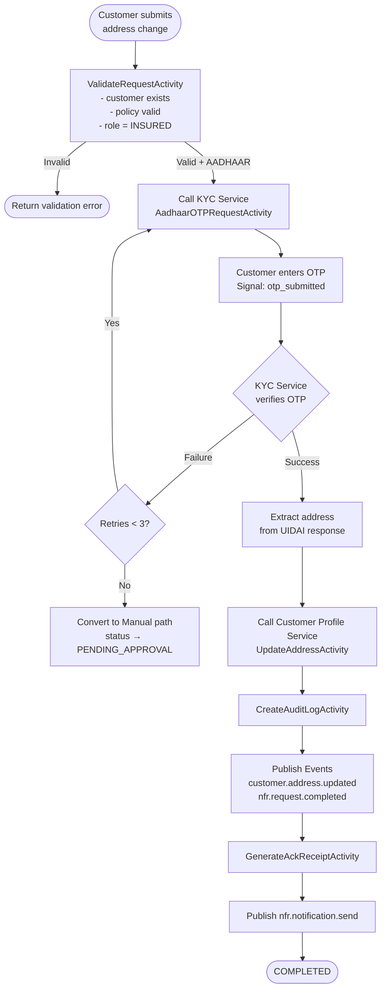
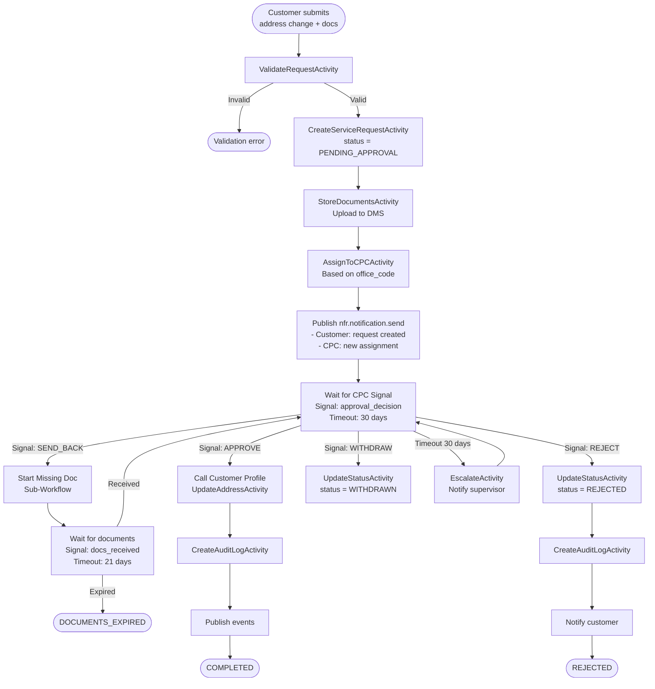
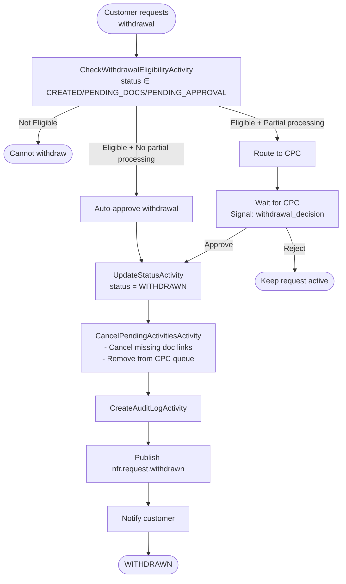
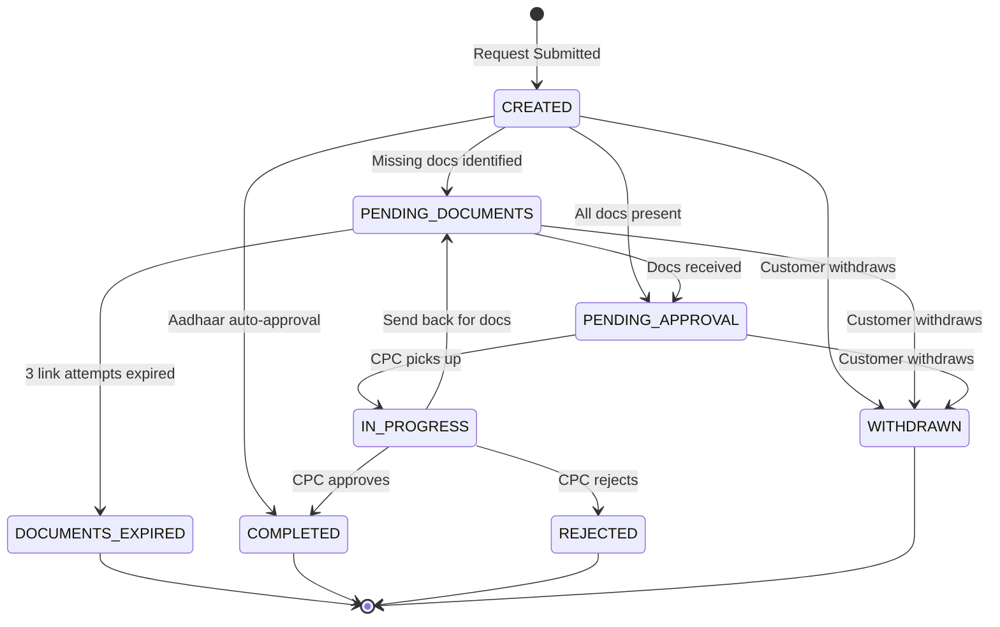

# Customer NFS (Non-Financial Service) - Detailed Requirements Analysis

## Document Control

| Attribute | Details |
|-----------|---------|
| **Module** | Customer NFS Service (Non-Financial Service) |
| **Phase** | Customer Domain - Non-Financial Operations |
| **Team** | Customer Management Team |
| **Analysis Date** | March 04, 2026 |
| **Source Documents** | req_customer_nfs_service.md |
| **Complexity** | High |
| **Technology Stack** | Golang, Temporal.io, PostgreSQL, Kafka, React |

---

## Table of Contents

1. [Executive Summary](#1-executive-summary)
2. [Business Rules](#2-business-rules)
3. [Functional Requirements](#3-functional-requirements)
4. [Validation Rules](#4-validation-rules)
5. [Error Codes](#5-error-codes)
6. [Workflows](#6-workflows)
7. [Data Entities](#7-data-entities)
8. [Integration Points](#8-integration-points)
9. [Temporal Workflows](#9-temporal-workflows)
10. [Traceability Matrix](#10-traceability-matrix)
11. [Service Request Status Machine](#11-service-request-status-machine)
12. [Document Requirements](#12-document-requirements)
13. [Notification Specifications](#13-notification-specifications)
14. [Exception Handling](#14-exception-handling)
15. [User Interface Requirements](#15-user-interface-requirements)
16. [Security and Access Control Details](#16-security-and-access-control-details)
17. [Performance SLAs](#17-performance-slas)
18. [Sample Scenarios and Examples](#18-sample-scenarios-and-examples)
19. [Glossary and Definitions](#19-glossary-and-definitions)
20. [Audit Trail Specifications](#20-audit-trail-specifications)
21. [Technology Stack](#21-technology-stack)
22. [Assumptions and Constraints](#22-assumptions-and-constraints)
23. [Open Questions](#23-open-questions)

---

## 1. Executive Summary

### 1.1 Purpose
This document provides comprehensive business requirements analysis for the **Customer NFS (Non-Financial Service)** module of the Postal Life Insurance (PLI) and Rural Postal Life Insurance (RPLI) system. This microservice is responsible for orchestrating non-financial service requests that modify **customer master data**, including address changes and name changes through both Aadhaar-based immediate processing and manual approval workflows.

### 1.2 Scope
The analysis covers the Customer NFS Service functionality including:
1. **Address Change (Aadhaar)** - Immediate address update via Aadhaar OTP verification
2. **Address Change (Manual)** - Document-based approval workflow for address updates
3. **Name Change (Aadhaar)** - Immediate name update via Aadhaar OTP verification
4. **Name Change (Manual)** - Document-based approval workflow for name updates
5. **Service Request Lifecycle** - Create, track, approve, withdraw operations
6. **Missing Document Collection** - Sub-workflow for document requests
7. **Withdrawal of Requests** - Customer-initiated request cancellation
8. **Audit Trail Management** - Complete transaction logging

### 1.3 Key Statistics

| Metric | Count |
|--------|-------|
| **Business Rules** | 16 |
| **Functional Requirements** | 12 |
| **Validation Rules** | 18 (including channel-specific and detailed logic) |
| **Workflows** | 5 |
| **Temporal Workflows** | 5 (with complete Go code) |
| **State Transitions** | 17 (defined state machine) |
| **Request Types** | 2 (Address Change, Name Change) |
| **Authentication Methods** | 2 (Aadhaar, Manual) |
| **Channels** | 5 (Portal, Mobile, PostOffice, CallCenter, AgentPortal) |
| **Data Entities** | 6 |
| **Integration Points** | 5 upstream + 5 downstream |
| **Error Codes** | 23 (13 address/name + 10 service request) |
| **API Endpoints** | 10 |
| **Assumptions** | 7 |
| **Constraints** | 5 |
| **Open Questions** | 5 |
| **Document Types** | 5 (Address Proof, Rental Agreement, Gazette, Newspaper, Application Form) |
| **Compensation Workflows** | 4 (address rollback, name rollback, policy revert, link cleanup) |

### 1.4 Critical Dependencies

| Dependency | Purpose | Impact |
|------------|---------|--------|
| **Customer Core Service** | Identity validation, name updates | Cannot process name changes without Core Service |
| **Customer Profile Service** | Address updates, contact data | Cannot process address changes without Profile Service |
| **KYC Service** | Aadhaar OTP verification | Aadhaar-based immediate processing unavailable without KYC |
| **Document Management Service** | Document storage and retrieval | Manual workflow cannot proceed without DMS |
| **Notification Service** | SMS/Email/WhatsApp dispatch | Customer notifications unavailable |

### 1.5 SLA Requirements

| Process | SLA | Penalty/Escalation |
|---------|-----|-------------------|
| Aadhaar-based Address/Name Change | Immediate (< 15 seconds) | Customer experience impact |
| Manual Address/Name Change Approval | 15-30 business days | SLA breach alerts, supervisor escalation |
| Missing Document Link Expiry | 7 days (configurable) | Auto-close after 3 expired links |
| Service Request Creation | < 500ms | Performance degradation alert |
| CPC Approval Action | < 200ms | Signal delivery timeout |

### 1.6 Key Business Rules Summary

#### Authentication Methods
- **Aadhaar-based**: Immediate completion (< 15 seconds), no human approval required
- **Manual**: 15-30 day approval workflow with CPC review, requires document verification

#### Address Change Rules

**Summary**: Address changes support two authentication methods - Aadhaar OTP (immediate completion) and Manual document upload (15-30 day approval workflow). Key rules include:
- Address versioning (never overwrite, always create new version)
- Only INSURED role changes handled by Customer NFS
- Communication address propagates to all downstream services
- Pincode must match selected state

#### Name Change Rules

**Summary**: Name changes support Aadhaar OTP (immediate) and Manual document upload (legal documents + 15-30 day approval). Key rules include:
- DOB is immutable - cannot be changed via name change workflow
- Name reflects across ALL linked policies via event propagation
- Aadhaar name becomes authoritative after OTP verification
- Requires at least one legal document for manual approval (Gazette, Newspaper, or Application Form)

#### Service Request Rules

**Summary**: Service request lifecycle management with ticket numbers, status transitions, withdrawal eligibility, document collection, and audit trail. Key rules include:
- Unique ticket number format: NFS-{TYPE}-{YYYYMMDD}-{SEQ6}
- 8 status states with 17 valid transitions
- Withdrawal allowed only for CREATED, PENDING_DOCUMENTS, PENDING_APPROVAL statuses
- Maximum 3 missing document link attempts per request
- Aadhaar auto-approval restricted to Portal/Mobile channels only
- Audit log is INSERT-only for regulatory compliance

#### Audit Trail Rules
- **Immutable audit**: INSERT-only table, no UPDATE or DELETE allowed
- **Retention**: 10 years minimum (regulatory compliance)
- **Partitioning**: Yearly partitions for query performance
- **Audit fields**: action_type, user_id, timestamp_utc, old_value, new_value, ip_address, channel, office_code

#### Workflow Summary
- **WF-1**: Address Change - Aadhaar Path (immediate < 15 seconds)
- **WF-2**: Address Change - Manual Approval (15-30 days, CPC review)
- **WF-3**: Name Change - Aadhaar Path (immediate < 15 seconds)
- **WF-4**: Name Change - Manual Approval (15-30 days, CPC review)
- **WF-5**: NFS Request Withdrawal (auto/manual approval based on processing status)

### 1.7 Document Structure

This analysis document follows the same structure as the IC_Incentive_Commission_Producer_Management_Analysis.md and contains **Customer NFS-specific content** extracted from the source document:

**Source Document**: `req_customer_nfs_service.md`

Content NOT included in this document (out of scope):
- Policy-level NFS operations (Agent Change, Nominee Change, Duplicate Bond)
- Refund of Premium processing
- Premium Receipt Book operations
- Communication dispatch (handled by Notification Service)

---

## 2. Business Rules

### 2.1 Address Change Rules

#### BR-NFS-001: Aadhaar-Based Address Change — Immediate Completion
- **ID**: BR-NFS-001
- **Category**: Workflow
- **Priority**: CRITICAL
- **Description**: Aadhaar OTP verified address changes complete immediately without human approval
- **Rule**:
  ```
  IF auth_method = 'AADHAAR' AND aadhaar_otp_verified = TRUE THEN
    service_request.status = 'COMPLETED'
    customer_address = aadhaar_response.address
    skip_manual_approval = TRUE
  END
  ```
- **Source**: `req_customer_nfs_service.md`, FS_ANC_004, Lines 76-87
- **Traceability**: FR-NFS-001
- **Impact**: Immediate customer satisfaction, reduced CPC workload
- **Example**: Customer initiates address change via Portal, enters Aadhaar OTP, address updated within 15 seconds.

#### BR-NFS-002: Manual Address Change — Approval Required
- **ID**: BR-NFS-002
- **Category**: Workflow
- **Priority**: CRITICAL
- **Description**: Document-based address changes require CPC approval within 15-30 business days
- **Rule**:
  ```
  IF auth_method = 'MANUAL' THEN
    service_request.status = 'PENDING_APPROVAL'
    assign_to_cpc_pool(office_code = customer.servicing_office)
    sla_deadline = created_at + 15_to_30_business_days
    trigger_approval_workflow = TRUE
  END
  ```
- **Source**: `req_customer_nfs_service.md`, FS_ANC_005, Lines 89-103
- **Traceability**: FR-NFS-002
- **Impact**: Human verification for document authenticity
- **Example**: Customer uploads address proof and rental agreement. CPC at servicing office reviews and approves after 5 days.

#### BR-NFS-003: Communication Address Update Propagation
- **ID**: BR-NFS-003
- **Category**: Data Propagation
- **Priority**: HIGH
- **Description**: Communication address updates propagate to all downstream services
- **Rule**:
  ```
  IF address_type = 'COMMUNICATION' AND address_update_for = 'INSURED' THEN
    update customer_master.communication_address
    publish event 'customer.address.updated'
    consumers = [Policy Service, Claims Service, Billing Service, Notification Service]
  END
  ```
- **Source**: `req_customer_nfs_service.md`, FS_ANC_006, Lines 268-275
- **Traceability**: FR-NFS-001, FR-NFS-002
- **Impact**: All future communications use new address
- **Example**: Customer updates communication address. All policy documents, renewal notices, and claim correspondence now use new address.

#### BR-NFS-004: Address Versioning — Never Overwrite
- **ID**: BR-NFS-004
- **Category**: Data Integrity
- **Priority**: CRITICAL
- **Description**: Address updates never overwrite existing records; always create new version
- **Rule**:
  ```
  ON address_update:
    -- Deactivate old address
    UPDATE address_versions 
    SET is_active = FALSE, effective_to = NOW()
    WHERE customer_id = target_customer AND is_active = TRUE
    
    -- Create new version
    INSERT INTO address_versions (
      customer_id, address_data, is_active, effective_from, version_number
    ) VALUES (
      target_customer, new_address, TRUE, NOW(), next_version_number
    )
  END
  ```
- **Source**: `req_customer_nfs_service.md`, BR-CUST-009, Lines 277-285
- **Traceability**: FR-NFS-001, FR-NFS-002, FR-NFS-008
- **Retention**: 10 years minimum
- **Impact**: Full audit trail, regulatory compliance

#### BR-NFS-005: Address Role Boundary
- **ID**: BR-NFS-005
- **Category**: Service Boundary
- **Priority**: HIGH
- **Description**: Only INSURED role address changes processed by Customer NFS
- **Rule**:
  ```
  IF address_update_for IN ['INSURED'] THEN
    process_in_customer_nfs()
  ELSE IF address_update_for IN ['PROPOSER', 'ASSIGNEE', 'TRUSTEE'] THEN
    delegate_to_policy_service()
    return redirect_message('Address change for ' + address_update_for + ' handled by Policy Service')
  END
  ```
- **Source**: `req_customer_nfs_service.md`, Section 4.4, Lines 287-294
- **Traceability**: FR-NFS-003
- **Impact**: Clear service boundaries, prevents data inconsistency

#### BR-NFS-006: Pincode-State Validation
- **ID**: BR-NFS-006
- **Category**: Validation
- **Priority**: HIGH
- **Description**: Pincode must match the selected state
- **Rule**:
  ```
  validate_pincode_state(pincode, state):
    pincode_prefix = SUBSTRING(pincode, 1, 2)
    valid_prefixes = get_state_pincode_prefixes(state)
    
    IF pincode_prefix NOT IN valid_prefixes THEN
      raise_error('ERR-NFS-ANC-003', 'Pincode does not match selected state')
      return FALSE
    END
    return TRUE
  ```
- **Source**: `req_customer_nfs_service.md`, BR-CUST-002, Lines 296-303
- **Traceability**: FR-NFS-001, FR-NFS-002
- **Impact**: Data quality, prevents invalid address entries

### 2.2 Name Change Rules

#### BR-NFS-007: Aadhaar-Based Name Change — Immediate Completion
- **ID**: BR-NFS-007
- **Category**: Workflow
- **Priority**: CRITICAL
- **Description**: Aadhaar OTP verified name changes complete immediately
- **Rule**:
  ```
  IF auth_method = 'AADHAAR' AND aadhaar_otp_verified = TRUE THEN
    service_request.status = 'COMPLETED'
    customer_name = {
      salutation: aadhaar_response.salutation,
      first_name: aadhaar_response.first_name,
      middle_name: aadhaar_response.middle_name,
      last_name: aadhaar_response.last_name
    }
    skip_manual_approval = TRUE
  END
  ```
- **Source**: `req_customer_nfs_service.md`, FS_ANC_008, Lines 305-314
- **Traceability**: FR-NFS-004
- **Impact**: Immediate processing, UIDAI as authoritative source

#### BR-NFS-008: Manual Name Change — Approval Required
- **ID**: BR-NFS-008
- **Category**: Workflow
- **Priority**: CRITICAL
- **Description**: Document-based name changes require legal documents and CPC approval
- **Rule**:
  ```
  IF auth_method = 'MANUAL' THEN
    required_documents = ['Gazette Notification', 'Newspaper Notification', 'Name Change Application Form']
    uploaded_docs = get_uploaded_documents(request_id)
    
    IF count(uploaded_docs WHERE type IN required_documents) < 1 THEN
      raise_error('ERR-NFS-ANC-004', 'At least one legal document required')
    END
    
    service_request.status = 'PENDING_APPROVAL'
    sla_deadline = created_at + 15_to_30_business_days
  END
  ```
- **Source**: `req_customer_nfs_service.md`, FS_ANC_005, Section 4.3, Lines 316-323
- **Traceability**: FR-NFS-005
- **Impact**: Legal verification for name changes

#### BR-NFS-009: Name Change Cross-Policy Propagation
- **ID**: BR-NFS-009
- **Category**: Data Propagation
- **Priority**: CRITICAL
- **Description**: Name changes reflect across all linked policies
- **Rule**:
  ```
  ON name_change_completion:
    affected_policies = get_customer_policies(customer_id)
    policies_affected_count = COUNT(affected_policies)
    
    publish_event('customer.name.updated', {
      customer_id: customer_id,
      old_name: old_name,
      new_name: new_name,
      policies_affected: policies_affected_count,
      source_request_id: request_id
    })
    
    -- Policy Service consumes and updates all policy records
  END
  ```
- **Source**: `req_customer_nfs_service.md`, FS_ANC_009, Lines 325-332
- **Traceability**: FR-NFS-004, FR-NFS-005
- **Impact**: Consistency across all customer policies

#### BR-NFS-010: DOB Immutability on Name Change
- **ID**: BR-NFS-010
- **Category**: Data Integrity
- **Priority**: CRITICAL
- **Description**: DOB cannot be modified via name change workflow
- **Rule**:
  ```
  validate_name_change_request(request):
    IF request.contains('date_of_birth') OR request.contains('dob') THEN
      raise_error('ERR-NFS-ANC-010', 'DOB cannot be modified via name change')
      return FALSE
    END
    return TRUE
  END
  ```
- **Source**: `req_customer_nfs_service.md`, BR-CUST-005, Lines 334-339
- **Traceability**: FR-NFS-004, FR-NFS-005
- **Impact**: Data integrity, separate process for DOB correction

### 2.3 Service Request Rules

#### BR-NFS-011: Ticket Number Generation
- **ID**: BR-NFS-011
- **Category**: Identification
- **Priority**: HIGH
- **Description**: Unique ticket number format for all NFS requests
- **Rule**:
  ```
  generate_ticket_number(request_type, created_date):
    type_code = CASE request_type
      WHEN 'ADDRESS_CHANGE' THEN 'ANC'
      WHEN 'NAME_CHANGE' THEN 'ANC'
      -- Future types can be added
    END
    
    date_part = FORMAT(created_date, 'YYYYMMDD')
    sequence = NEXT_VAL('nfs_ticket_sequence')
    sequence_padded = LPAD(sequence, 6, '0')
    
    return 'NFS-' + type_code + '-' + date_part + '-' + sequence_padded
  END
  ```
- **Examples**: `NFS-ANC-20260304-000001`
- **Source**: `req_customer_nfs_service.md`, Lines 341-349
- **Traceability**: FR-NFS-006

#### BR-NFS-012: Service Request Status Machine
- **ID**: BR-NFS-012
- **Category**: State Transition
- **Priority**: CRITICAL
- **Description**: Valid status transitions for NFS service requests
- **State Machine**:
  ```
  VALID_TRANSITIONS = {
    'CREATED': ['PENDING_DOCUMENTS', 'PENDING_APPROVAL', 'COMPLETED', 'WITHDRAWN'],
    'PENDING_DOCUMENTS': ['PENDING_APPROVAL', 'DOCUMENTS_EXPIRED', 'WITHDRAWN'],
    'PENDING_APPROVAL': ['IN_PROGRESS', 'WITHDRAWN'],
    'IN_PROGRESS': ['COMPLETED', 'REJECTED', 'PENDING_DOCUMENTS'],
    'DOCUMENTS_EXPIRED': [],  -- Terminal state
    'COMPLETED': [],          -- Terminal state
    'REJECTED': [],           -- Terminal state
    'WITHDRAWN': []           -- Terminal state
  }
  ```
- **Source**: `req_customer_nfs_service.md`, Lines 351-378
- **Traceability**: FR-NFS-006, FR-NFS-007
- **Terminal States**: DOCUMENTS_EXPIRED, COMPLETED, REJECTED, WITHDRAWN (no further transitions allowed)
- **SLA Deadlines**: PENDING_APPROVAL timeout: 30 days (escalation to supervisor)
- **State Transition Rules**:
  - CREATED → COMPLETED: Only possible via Aadhaar OTP verification
  - CREATED → PENDING_APPROVAL: Manual document upload path
  - IN_PROGRESS → PENDING_DOCUMENTS: CPC can send back for missing documents
  - IN_PROGRESS → COMPLETED: CPC approval workflow completion
  - IN_PROGRESS → REJECTED: CPC rejection with reason

#### BR-NFS-013: Withdrawal Eligibility
- **ID**: BR-NFS-013
- **Category**: Workflow
- **Priority**: MEDIUM
- **Description**: Withdrawal allowed only for specific statuses
- **Rule**:
  ```
  check_withdrawal_eligibility(request):
    eligible_statuses = ['CREATED', 'PENDING_DOCUMENTS', 'PENDING_APPROVAL']
    ineligible_statuses = ['IN_PROGRESS', 'COMPLETED', 'REJECTED', 'WITHDRAWN', 'DOCUMENTS_EXPIRED']
    
    IF request.status IN eligible_statuses THEN
      IF has_partial_processing(request) THEN
        return {eligible: TRUE, approval_type: 'MANUAL', reason: 'Partial processing detected'}
      ELSE
        return {eligible: TRUE, approval_type: 'AUTO', reason: 'No interim changes'}
      END
    ELSE
      return {eligible: FALSE, reason: 'Status ' + request.status + ' not withdrawable'}
    END
  END
  ```
- **Source**: `req_customer_nfs_service.md`, FS_WSR_002, Lines 380-385
- **Traceability**: FR-NFS-007
- **Inconsistency Note**: This rule includes CREATED in eligible statuses (consistent with BR-NFS-012 state machine), but FR-NFS-007 acceptance criteria #1 only lists PENDING_DOCUMENTS and PENDING_APPROVAL. Implementation follows BR-NFS-013 (includes CREATED).

#### BR-NFS-014: Missing Document Link Expiry
- **ID**: BR-NFS-014
- **Category**: Time-Based
- **Priority**: MEDIUM
- **Description**: Secure upload links expire after configurable period
- **Rule**:
  ```
  manage_missing_doc_link(request_id, document_type):
    max_attempts = 3
    default_expiry_days = 7
    
    current_attempts = get_link_generation_count(request_id)
    
    IF current_attempts >= max_attempts THEN
      update_request_status(request_id, 'DOCUMENTS_EXPIRED')
      notify_customer('Documents not received. Request auto-closed.')
      return {success: FALSE, reason: 'Max attempts reached'}
    END
    
    new_link = generate_secure_upload_link(
      request_id = request_id,
      document_type = document_type,
      expiry = NOW() + default_expiry_days
    )
    
    increment_link_generation_count(request_id)
    notify_customer_with_link(new_link)
    
    return {success: TRUE, link: new_link, expiry: default_expiry_days}
  END
  ```
- **Source**: `req_customer_nfs_service.md`, FS_MRD_003, Lines 387-392
- **Traceability**: FR-NFS-009

#### BR-NFS-015: Aadhaar Auto-Approval Channel Restriction
- **ID**: BR-NFS-015
- **Category**: Validation
- **Priority**: MEDIUM
- **Description**: Aadhaar auto-approval only available from digital channels
- **Rule**:
  ```
  validate_auth_method_for_channel(auth_method, channel):
    digital_channels = ['Portal', 'Mobile']
    assisted_channels = ['PostOffice', 'CallCenter', 'AgentPortal']
    
    IF auth_method = 'AADHAAR' AND channel IN assisted_channels THEN
      -- Force manual workflow even with Aadhaar
      return {valid: TRUE, force_manual: TRUE, reason: 'Assisted channels require maker-checker'}
    END
    
    return {valid: TRUE, force_manual: FALSE}
  END
  ```
- **Source**: `req_customer_nfs_service.md`, Lines 394-400
- **Traceability**: FR-NFS-010
- **Rationale**: Post Office staff-assisted flow needs maker-checker for accountability

#### BR-NFS-016: Audit Trail Immutability
- **ID**: BR-NFS-016
- **Category**: Compliance
- **Priority**: CRITICAL
- **Description**: All NFS audit records are INSERT-only
- **Rule**:
  ```
  -- Database constraint
  CREATE TABLE nfs_audit_log (
    audit_id UUID PRIMARY KEY,
    request_id UUID NOT NULL,
    action_type VARCHAR(50) NOT NULL,
    old_value JSONB,
    new_value JSONB,
    performed_by UUID NOT NULL,
    performed_at TIMESTAMP NOT NULL,
    ip_address VARCHAR(50),
    channel VARCHAR(20),
    office_code VARCHAR(20),
    remarks TEXT
  );
  
  -- No UPDATE or DELETE permissions granted to any role
  GRANT INSERT ON nfs_audit_log TO nfs_service_role;
  -- Explicitly deny UPDATE and DELETE
  REVOKE UPDATE, DELETE ON nfs_audit_log FROM ALL;
  ```
- **Retention**: 10 years minimum
- **Source**: `req_customer_nfs_service.md`, FS_ANC_011, FS_AT_002, FS_AT_009, Lines 402-408
- **Traceability**: FR-NFS-008

---

## 3. Functional Requirements

### 3.1 Address Change Requirements

#### FR-NFS-001: Address Change via Aadhaar Authentication (Immediate)
- **ID**: FR-NFS-001
- **Priority**: HIGH
- **Description**: Customer initiates address change with Aadhaar OTP. On successful verification, address fetched from UIDAI becomes the new address immediately.
- **Acceptance Criteria**:
  1. Customer provides customer_id, policy_number, Aadhaar number, and change type
  2. System sends OTP request to KYC Service → UIDAI
  3. Customer submits OTP; KYC Service verifies and returns Aadhaar address data
  4. If verified: NFS Service calls Customer Profile Service (`UpdateAddressActivity`) with new address
  5. Old address version marked `is_active=false`, new version created
  6. Service request status set to COMPLETED immediately
  7. Events published: `customer.address.updated`, `nfr.request.completed`
  8. Acknowledgment receipt generated (PDF with ticket number)
  9. SMS/Email notification sent to customer
- **Source**: `req_customer_nfs_service.md`, FS_ANC_001, FS_ANC_004, FS_ANC_006, FS_ANC_012, FS_ANC_013, Lines 73-87
- **Traceability**: BR-NFS-001, BR-NFS-004

#### FR-NFS-002: Address Change via Manual Document Upload (Approval Workflow)
- **ID**: FR-NFS-002
- **Priority**: HIGH
- **Description**: When Aadhaar-based change is not possible, customer submits supporting documents for CPC review.
- **Acceptance Criteria**:
  1. Customer submits: customer_id, policy_number, new address fields, document uploads
  2. Required documents: Address Proof (mandatory), Rental Agreement (optional), Application Form (optional)
  3. System creates service request with status PENDING_APPROVAL
  4. Service request assigned to CPC user at customer's servicing office
  5. CPC user can: Approve, Reject, Send Back for Corrections, or Request Missing Documents
  6. On Approve: NFS Service calls Customer Profile Service; status → COMPLETED
  7. On Reject: reason recorded; customer notified; status → REJECTED
  8. On Request Missing Documents: triggers Missing Document sub-workflow (FR-NFS-009)
  9. Approval timeline: 15–30 business days
  10. SLA monitoring with escalation if approval exceeds timeline
- **Source**: `req_customer_nfs_service.md`, FS_ANC_001, FS_ANC_002, FS_ANC_003, FS_ANC_005, Lines 89-103
- **Traceability**: BR-NFS-002, BR-NFS-003

#### FR-NFS-003: Address Change for Multiple Roles
- **ID**: FR-NFS-003
- **Priority**: MEDIUM
- **Description**: Address change supports updating address for different roles on the policy.
- **Acceptance Criteria**:
  1. `address_update_for` field supports: INSURED, PROPOSER, ASSIGNEE, TRUSTEE
  2. `address_type` field supports: COMMUNICATION, PERMANENT, OFFICIAL
  3. If role is INSURED, address propagates to customer master record
  4. If role is PROPOSER/ASSIGNEE/TRUSTEE, address stored as policy-level address (delegated to Policy Service)
  5. Only INSURED address changes are processed by this service
- **Source**: `req_customer_nfs_service.md`, Section 4.4, Lines 105-115
- **Traceability**: BR-NFS-005

### 3.2 Name Change Requirements

#### FR-NFS-004: Name Change via Aadhaar Authentication (Immediate)
- **ID**: FR-NFS-004
- **Priority**: HIGH
- **Description**: Customer initiates name change with Aadhaar OTP. Name from UIDAI becomes authoritative.
- **Acceptance Criteria**:
  1. Customer provides customer_id, policy_number, Aadhaar number
  2. OTP verification via KYC Service → UIDAI
  3. If verified: extract salutation, first_name, middle_name, last_name from UIDAI response
  4. NFS Service calls Customer Core Service (`UpdateIdentityActivity`) with new name fields
  5. Old name preserved in audit history (name_change_history table)
  6. Name reflects across all linked policies — event `customer.name.updated` published
  7. Policy Service consumes event and updates policy records
  8. Service request status set to COMPLETED immediately
  9. DOB remains immutable — name change does NOT alter DOB
- **Source**: `req_customer_nfs_service.md`, FS_ANC_007, FS_ANC_008, FS_ANC_009, Lines 117-131
- **Traceability**: BR-NFS-007, BR-NFS-009, BR-NFS-010

#### FR-NFS-005: Name Change via Manual Document Upload (Approval Workflow)
- **ID**: FR-NFS-005
- **Priority**: HIGH
- **Description**: When Aadhaar-based name change is not possible, customer provides legal documents.
- **Acceptance Criteria**:
  1. Customer submits: customer_id, policy_number, new name, salutation, document uploads
  2. Required documents (at least one): Gazette Notification, Newspaper Notification, Name Change Application Form
  3. System creates service request with status PENDING_APPROVAL
  4. CPC user verifies documents against submitted name
  5. Approval/Rejection/Send Back flows identical to FR-NFS-002
  6. On Approve: Customer Core updated, all linked policies updated, events published
  7. On Reject: reason logged, customer notified
  8. Approval timeline: 15–30 business days
- **Source**: `req_customer_nfs_service.md`, FS_ANC_007, FS_ANC_003, FS_ANC_005, Lines 133-146
- **Traceability**: BR-NFS-008, BR-NFS-009

### 3.3 Service Request Management Requirements

#### FR-NFS-006: Service Request Lifecycle Management
- **ID**: FR-NFS-006
- **Priority**: HIGH
- **Description**: Unified service request tracking for all customer NFS operations.
- **Acceptance Criteria**:
  1. Every NFS operation creates a service request with unique ticket_number
  2. Ticket format: `NFS-{TYPE}-{YYYYMMDD}-{SEQ}`
  3. Status lifecycle per BR-NFS-012
  4. Each status transition logged with timestamp, user_id, reason
  5. Assignment to CPC user based on servicing office of the customer
  6. SLA tracking per NFS type: address change (15 days), name change (15 days), Aadhaar-based (immediate)
  7. Dashboard-queryable: pending requests by type, by office, by age, by status
  8. Acknowledgment receipt generated on request creation
- **Source**: `req_customer_nfs_service.md`, FS_ANC_005, FS_ANC_010, FS_ANC_012, Lines 148-160
- **Traceability**: BR-NFS-011, BR-NFS-012

#### FR-NFS-007: Withdrawal of Customer NFS Request
- **ID**: FR-NFS-007
- **Priority**: MEDIUM
- **Description**: Customer can withdraw a pending request before it is approved/completed.
- **Acceptance Criteria**:
  1. Withdrawal allowed only for requests in status: PENDING_DOCUMENTS, PENDING_APPROVAL
  2. Withdrawal NOT allowed for: COMPLETED, REJECTED, IN_PROGRESS, WITHDRAWN
  3. Auto-approval for eligible withdrawals (no interim changes applied)
  4. Manual approval required if any partial processing has occurred
  5. On successful withdrawal: status → WITHDRAWN_BY_CUSTOMER, archived flag set
  6. Events published: `nfr.request.withdrawn`
  7. Customer notified via SMS/Email
  8. Audit trail records withdrawal with reason
- **Source**: `req_customer_nfs_service.md`, FS_WSR_001–FS_WSR_006, Lines 162-175
- **Traceability**: BR-NFS-013

#### FR-NFS-008: Audit Trail for All NFS Operations
- **ID**: FR-NFS-008
- **Priority**: CRITICAL
- **Description**: Complete, tamper-proof audit trail for every NFS action.
- **Acceptance Criteria**:
  1. Every action logged with: user_id, timestamp (UTC), action_type, old_value, new_value, IP address, channel
  2. Audit records are INSERT-only — no UPDATE or DELETE allowed
  3. Retention: 10 years minimum
  4. Audit data partitioned by year for query performance
  5. Exportable in PDF/Excel for regulatory reporting
  6. Changes reflected in reports and dashboards
- **Source**: `req_customer_nfs_service.md`, FS_ANC_011, FS_WSR_006, FS_AT_001–FS_AT_009, Lines 177-188
- **Traceability**: BR-NFS-016

#### FR-NFS-009: Missing Document Collection Sub-Workflow
- **ID**: FR-NFS-009
- **Priority**: MEDIUM
- **Description**: When CPC user identifies missing documents, system sends secure upload link.
- **Acceptance Criteria**:
  1. CPC user selects missing document types from predefined list per NFS type
  2. System generates time-limited secure upload URL (default 7 days expiry)
  3. Notification sent to customer via SMS/Email/WhatsApp with upload link
  4. Customer uploads documents via link or submits physically at Post Office
  5. Physical submission: Post Office staff indexes document against Missing Document Request ID
  6. On document receipt: CPC user notified; status moves from PENDING_DOCUMENTS → PENDING_APPROVAL
  7. If link expires without submission: reminder sent, new link generated (up to 3 attempts)
  8. After 3 expired links: request auto-closed with status DOCUMENTS_EXPIRED
  9. Previously raised missing document requests visible in a status table
- **Source**: `req_customer_nfs_service.md`, FS_MRD_001–FS_MRD_005, Lines 190-204
- **Traceability**: BR-NFS-014

#### FR-NFS-010: Multi-Channel Request Initiation
- **ID**: FR-NFS-010
- **Priority**: HIGH
- **Description**: NFS requests can be initiated from multiple channels with unified processing.
- **Acceptance Criteria**:
  1. Supported channels: Customer Portal, Mobile App, Post Office Counter (RICT), Call Center, Agent Portal
  2. Channel recorded on service request for SLA and reporting differentiation
  3. Post Office channel: requires Service Request Indexing page (staff-assisted)
  4. Portal/Mobile: self-service with Aadhaar option
  5. All channels converge to the same Temporal workflow
  6. Channel-specific validation: Aadhaar-based auto-approval only from Portal/Mobile
- **Source**: `req_customer_nfs_service.md`, FS_ANC_001, FS_WSR_001, Lines 206-217
- **Traceability**: BR-NFS-015

#### FR-NFS-011: CPC User Work Queue and Dashboard
- **ID**: FR-NFS-011
- **Priority**: MEDIUM
- **Description**: CPC users need a work queue showing pending NFS requests.
- **Acceptance Criteria**:
  1. Dashboard shows: pending requests grouped by type (Address Change, Name Change)
  2. Filters: by status, by SLA (within SLA, approaching SLA, breached SLA), by date range
  3. CPC user can open request details, view documents, and take action
  4. Assignment: auto-assigned to CPC pool at customer's servicing office; can be manually reassigned
  5. SLA breach alerts: notification to supervisor when request approaches/breaches SLA
  6. Request detail view shows: customer info, current data, proposed changes, uploaded documents, comments history
- **Source**: `req_customer_nfs_service.md`, FS_ANC_005, FS_MRD_004, Lines 219-230
- **Traceability**: BR-NFS-002

#### FR-NFS-012: Notification on Status Updates
- **ID**: FR-NFS-012
- **Priority**: HIGH
- **Description**: Customer receives notifications at every status transition.
- **Acceptance Criteria**:
  1. Notification triggers: Request Created, Documents Received, Approval Pending, Approved, Rejected, Send Back, Withdrawn, Documents Expired
  2. Channels: SMS + Email (mandatory), WhatsApp (if opted-in)
  3. Notification content includes: ticket number, request type, new status, next action
  4. NFS Service publishes event; Notification Service handles dispatch
  5. Acknowledgment receipt attached to "Request Created" notification (PDF)
- **Source**: `req_customer_nfs_service.md`, FS_ANC_013, FS_WSR_005, Lines 232-242
- **Traceability**: None (cross-cutting concern)

---

## 4. Validation Rules

| Rule ID | Entity | Field | Validation | Error Message |
|---------|--------|-------|------------|---------------|
| VR-NFS-001 | Address | pincode | 6 digits AND matches state | "Invalid pincode for selected state" |
| VR-NFS-002 | Address | state | Must be valid Indian state from master | "Invalid state" |
| VR-NFS-003 | Address | address_line1 | Not empty, max 200 chars | "Address line 1 is required" |
| VR-NFS-004 | Address | city | Not empty, max 100 chars | "City is required" |
| VR-NFS-005 | Address | district | Not empty, max 100 chars | "District is required" |
| VR-NFS-006 | Name | first_name | Not empty, alpha + spaces, max 100 | "First name is required" |
| VR-NFS-007 | Name | last_name | Not empty, alpha + spaces, max 100 | "Last name is required" |
| VR-NFS-008 | Name | salutation | Must be in {Mr, Mrs, Ms, Shri, Smt, Dr} | "Invalid salutation" |
| VR-NFS-009 | Document | file_size | Max 5 MB | "File exceeds maximum size of 5 MB" |
| VR-NFS-010 | Document | mime_type | Must be PDF, JPEG, or PNG | "Unsupported file format" |
| VR-NFS-011 | Request | auth_method | Must be AADHAAR or MANUAL | "Invalid authentication method" |
| VR-NFS-012 | Request | channel | Must be valid channel enum | "Invalid channel" |
| VR-NFS-013 | Address | address_update_for | If not INSURED, reject from NFS | "Non-insured address changes handled by Policy Service" |
| VR-NFS-014 | Name | dob | Must NOT be present in name change request | "DOB cannot be modified via name change" |
| VR-NFS-015 | Request | duplicate_check | No PENDING request of same type for same customer | "A pending request already exists" |

### 4.1 Validation Logic Details

**VR-NFS-001: Pincode-State Matching Logic**
```
validate_pincode_state(pincode, state):
  pincode_prefix = SUBSTRING(pincode, 1, 2)
  valid_prefixes = {
    '01': ['Delhi'],
    '02': ['Haryana', 'Himachal Pradesh'],
    '03': ['Punjab', 'Chandigarh'],
    '05': ['Uttar Pradesh', 'Uttarakhand'],
    '07': ['Bihar', 'Jharkhand'],
    '08': ['West Bengal', 'Sikkim'],
    ... (complete mapping for all 36 states/UTs)
  }
  
  IF pincode_prefix NOT IN valid_prefixes.keys() THEN
    return FALSE
  END
  
  IF state NOT IN valid_prefixes[pincode_prefix] THEN
    return error('ERR-NFS-ANC-003')
  END
  
  return TRUE
END
```

**VR-NFS-006/007: Name Field Validation**
```
validate_name_field(field_value, field_name):
  min_length = 2
  max_length = 100
  allowed_pattern = ^[a-zA-Z\s]+$
  
  IF LENGTH(field_value) < min_length OR LENGTH(field_value) > max_length THEN
    return error(field_name + ' must be between ' + min_length + ' and ' + max_length + ' characters')
  END
  
  IF field_value NOT MATCH allowed_pattern THEN
    return error(field_name + ' can only contain alphabets and spaces')
  END
  
  return TRUE
END
```

**VR-NFS-015: Duplicate Request Check**
```
check_duplicate_request(customer_id, request_type):
  pending_requests = SELECT * FROM nfs_service_request
    WHERE customer_id = [customer_id]
    AND request_type = [request_type]
    AND status IN ['CREATED', 'PENDING_DOCUMENTS', 'PENDING_APPROVAL', 'IN_PROGRESS']
  
  IF COUNT(pending_requests) > 0 THEN
    existing_ticket = pending_requests[0].ticket_number
    return error('ERR-NFS-SR-001', 
                'Pending request exists: ' + existing_ticket + 
                '. Complete or withdraw it first.')
  END
  
  return TRUE
END
```

---

## 5. Error Codes

### 5.1 Address/Name Change Errors (ERR-NFS-ANC-xxx)

| Code | HTTP | Description | Recovery | Retryable |
|------|------|-------------|----------|-----------|
| ERR-NFS-ANC-001 | 404 | Customer not found in Customer Core Service | Verify customer_id exists in system | Yes |
| ERR-NFS-ANC-002 | 404 | Policy not found or inactive | Verify policy_number and policy status | No |
| ERR-NFS-ANC-003 | 400 | Invalid address: pincode-state mismatch | Correct pincode or state selection | No |
| ERR-NFS-ANC-004 | 400 | Missing required documents for manual change | Upload required documents | N/A |
| ERR-NFS-ANC-005 | 400 | Invalid auth_method for channel | Aadhaar auto-approval not available from PostOffice/CallCenter/AgentPortal | N/A (use manual) |
| ERR-NFS-ANC-006 | 422 | Aadhaar OTP verification failed | Retry OTP (up to 3 attempts) or switch to manual | Yes (with backoff) |
| ERR-NFS-ANC-007 | 422 | Aadhaar OTP expired (10 minutes) | Request new OTP | Yes |
| ERR-NFS-ANC-008 | 429 | OTP retry limit exceeded (3 attempts) | Switch to manual document upload path | No |
| ERR-NFS-ANC-009 | 400 | Name contains invalid characters | Use only alphabets and spaces | N/A |
| ERR-NFS-ANC-010 | 403 | DOB modification attempted via name change | DOB is immutable; separate Directorate process required | No |
| ERR-NFS-ANC-011 | 400 | Address role not in customer boundary | PROPOSER/ASSIGNEE/TRUSTEE → use Policy Service | N/A (different service) |
| ERR-NFS-ANC-012 | 503 | KYC Service unavailable | Retry or use manual path (fallback to 3 attempts) | Yes |
| ERR-NFS-ANC-013 | 500 | Customer Core/Profile update failed | Retry; workflow will compensate if persistent failure | Yes (3x)

### 5.2 Service Request Errors (ERR-NFS-SR-xxx)

| Code | HTTP | Description | Recovery | Retryable |
|------|------|-------------|----------|----------|
| ERR-NFS-SR-001 | 409 | Duplicate request: pending request exists for same customer + type | Complete or withdraw existing request first | No |
| ERR-NFS-SR-002 | 409 | Cannot withdraw: request status not eligible | Check request status (must be CREATED/PENDING_DOCS/PENDING_APPROVAL) | No |
| ERR-NFS-SR-003 | 404 | Service request not found | Verify request_id exists in system | No |
| ERR-NFS-SR-004 | 403 | Not authorized to act on this request | Must be assigned CPC user or request owner (customer) | No |
| ERR-NFS-SR-005 | 422 | Missing rejection reason | Provide mandatory rejection_reason field when rejecting | No |
| ERR-NFS-SR-006 | 410 | Secure upload link expired | Request new link if link_generation_count < 3 | No (generate new) |
| ERR-NFS-SR-007 | 429 | Maximum missing doc link attempts reached (3) | Request auto-closed; customer must create NEW request | No |
| ERR-NFS-SR-008 | 400 | File too large (max 5 MB) | Reduce file size before upload | No |
| ERR-NFS-SR-009 | 400 | Unsupported file type | Use PDF, JPEG, or PNG only | No |
| ERR-NFS-SR-010 | 503 | Document Management Service unavailable | Retry upload with exponential backoff | Yes (3x) |

### 5.3 Error Handling Strategy

**Error Recovery Hierarchy:**
```
ON ERROR occurrence:
  1. Classify error type
     - Validation errors (400): Return immediately to user
     - Authorization errors (403): Log security event, return to user
     - Not found errors (404): Inform user to verify IDs
     - Conflict errors (409): Guide user to resolve conflict
     - Unavailable errors (503): Implement retry with backoff
     - Internal errors (500): Log full context, alert operations, return generic message
  
  2. Apply retry policy (if retryable)
     IF retry_count < max_retries THEN
        wait_time = base_backoff * (2 ^ retry_count)
        sleep(wait_time)
        retry_count++
        TRY again
     ELSE
        failover_to_alternative()
        log_error('Max retries exceeded. Failed.')
     END
  
  3. Apply compensation (if partial success)
     IF partial_committed THEN
        trigger_compensation_workflow(request_id)
        notify_support_team(request_id, error_code)
     END
  
  4. Log error for audit
     INSERT INTO nfs_audit_log (
       request_id, action_type, old_value, new_value,
       error_code, error_message, performed_by
     )
END
```

**Error Alerting Rules:**
- **Critical (500 errors)**: Immediate operations alert, page DevOps team
- **High (503, 429)**: SLA degradation alert, email supervisor
- **Medium (403, 404)**: User-facing error, log for analytics
- **Low (400)**: Validation errors, help text provided

---

## 6. Workflows

### Workflow 1: Address Change — Aadhaar Path



**Temporal Configuration:**
- Workflow ID: `nfs-address-aadhaar-{request_id}`
- Task Queue: `customer-nfs-tq`
- Execution Timeout: 10 minutes (OTP timeout)
- Signal: `otp_submitted` (customer enters OTP)

### Workflow 2: Address Change — Manual Approval Path



**Temporal Configuration:**
- Workflow ID: `nfs-address-manual-{request_id}`
- Task Queue: `customer-nfs-tq`
- Execution Timeout: 45 days (30 day approval + 15 day buffer)
- Signals: `approval_decision`, `docs_received`, `withdraw_request`
- Queries: `get_status`, `get_request_detail`
- Compensation Strategy: Rollback address version if profile update fails
- Activity Retry Policies:
  - StoreDocumentsActivity: 3x retry, 5s backoff (DMS may be slow)
  - UpdateAddressActivity: 2x retry, 10s backoff (critical operation)

**Rejection and Send Back Handling:**
- **REJECT**: CPC must provide mandatory `rejection_reason`. Status → REJECTED (terminal). Customer notified with reason. 
- **SEND_BACK for Missing Documents**:
  1. CPC selects document types from predefined list
  2. System triggers Missing Document sub-workflow
  3. Status → PENDING_DOCUMENTS
  4. Customer gets secure upload link (7-day expiry, max 3 generations)
  5. On upload: status → PENDING_APPROVAL, CPC re-notified
  6. After 3 expired links: status → DOCUMENTS_EXPIRED
- **Compensation on Reject**: If rejection occurs after address update succeeded:
  ```
  compensate_address_update(request_id):
    address_change = SELECT * FROM nfs_address_change_detail WHERE request_id = request_id
    restore_address_version(request_id, address_change.old_address)
    publish_event('customer.address.rolled_back', {request_id, reason: 'Approval rejected'})
  END
  ```

### Workflow 3: Name Change — Aadhaar Path

Identical structure to Workflow 1 but calls `UpdateIdentityActivity` on Customer Core Service instead of `UpdateAddressActivity` on Profile Service. Additionally publishes `customer.name.updated` with `policies_affected` count.

**Temporal Configuration:**
- Workflow ID: `nfs-name-aadhaar-{request_id}`
- Task Queue: `customer-nfs-tq`
- Execution Timeout: 10 minutes

### Workflow 4: Name Change — Manual Approval Path

Identical structure to Workflow 2 but:
- Required documents: Gazette Notification / Newspaper Notification / Name Change Form
  - **At least ONE mandatory**: Gazette Notification OR Newspaper Notification
  - **Optional**: Name Change Application Form
- On approval: calls `UpdateIdentityActivity` on Customer Core (name fields only, DOB immutable)
- Publishes `customer.name.updated` with `policies_affected` count
- Additional Validation: VR-NFS-014 ensures DOB field is not present in request payload

**Temporal Configuration:**
- Workflow ID: `nfs-name-manual-{request_id}`
- Task Queue: `customer-nfs-tq`
- Execution Timeout: 45 days (30 day approval + 15 day buffer)
- Signals: `approval_decision`, `docs_received`, `withdraw_request`
- Compensation Strategy: Rollback name change if Core update fails

**Document Verification Rules for Name Change:**
1. **Gazette Notification**: Must be official government gazette showing old name → new name
2. **Newspaper Notification**: Must be from recognized newspaper, showing ad format
3. **Name Change Form**: Must be NOTARIZED if Gazette/Not available
4. **Cross-Reference**: Name must match Aadhaar IF Aadhaar available (for consistency)

**Compensation on Reject**: If rejection occurs after name update succeeded:
```
compensate_name_change(request_id):
  name_change = SELECT * FROM nfs_name_change_detail WHERE request_id = request_id
  restore_previous_name(change.old_salutation, change.old_first_name,
                   change.old_middle_name, change.old_last_name)
  
  -- Revert all affected policies
  affected_policies = get_customer_policies(customer_id)
  FOR EACH policy IN affected_policies:
    update_policy_holder_name(policy.id, change.old_name, change.old_salutation)
  END
  
  publish_event('customer.name.rolled_back', {
    request_id: request_id,
    policies_reverted: LENGTH(affected_policies),
    reason: 'Approval rejected'
  })
  
  audit_log_rollback(customer_id, change.old_name, change.new_name, 'NAME_CHANGE_REJECTED')
END
```

### Workflow 5: NFS Request Withdrawal



**Temporal Configuration:**
- Workflow ID: `nfs-withdrawal-{request_id}`
- Task Queue: `customer-nfs-tq`
- Execution Timeout: 5 days (if manual CPC approval needed)
- Signals: `withdrawal_decision` (for CPC approval path)

**Withdrawal Eligibility Logic:**
```
check_withdrawal_eligibility(request):
  // Check status eligibility per BR-NFS-013
  eligible_statuses = ['CREATED', 'PENDING_DOCUMENTS', 'PENDING_APPROVAL']
  
  IF request.status NOT IN eligible_statuses THEN
    return {eligible: FALSE, reason: 'Request status: ' + request.status + ' does not allow withdrawal'}
  END
  
  // Check for partial processing
  partial_processing_flags = [
    request.address_updated,      // For address change
    request.name_updated,          // For name change
    request.policy_count > 0,     // For name change (policies updated)
    request.documents_verified_count > 0  // Documents already reviewed
  ]
  
  has_partial_processing = FALSE
  FOR EACH flag IN partial_processing_flags:
    IF flag THEN
      has_partial_processing = TRUE
      BREAK
    END
  END
  
  IF has_partial_processing THEN
    // Requires CPC manual approval
    return {eligible: TRUE, approval_type: 'MANUAL', reason: 'Partial processing detected'}
  ELSE
    // Can auto-approve
    return {eligible: TRUE, approval_type: 'AUTO', reason: 'No interim changes'}
  END
END
```

**Manual CPC Approval Path:**
1. Customer requests withdrawal
2. System detects partial processing (e.g., CPC already reviewed documents)
3. Creates child workflow for CPC approval
4. CPC sees withdrawal request in work queue with priority: HIGH
5. CPC can:
   - **APPROVE**: Proceed with withdrawal
   - **REJECT**: Keep request active, notify customer
6. If APPROVED: All pending activities cancelled, status → WITHDRAWN
7. If REJECTED: Request continues in current state

**Cancellation of Pending Activities:**
```
cancel_pending_activities(request_id):
  // 1. Cancel all active missing document links
  UPDATE nfs_missing_document_request
  SET status = 'CANCELLED'
  WHERE request_id = request_id AND status IN ('PENDING')
  
  // 2. Remove from CPC work queue
  DELETE FROM cpc_work_queue WHERE request_id = request_id
  
  // 3. Update workflow state
  cancel_workflow_signals(request_id)
  
  // 4. Log cancellation
  INSERT INTO nfs_audit_log (action_type, old_value, new_value, remarks)
  VALUES ('PENDING_ACTIVITIES_CANCELLED', 
          JSON(request.status), 
          JSON({status: 'WITHDRAWN'}), 
          'All pending activities cancelled due to withdrawal')
END
```

---

## 7. Data Entities

### 7.1 Entity: NFS Service Request

**Description:** Central entity tracking every customer NFS request through its lifecycle.

| Attribute | Type | Mandatory | Description | Validation |
|-----------|------|-----------|-------------|------------|
| request_id | UUID | Yes | Primary key | System-generated |
| ticket_number | VARCHAR(30) | Yes | Human-readable ID | Format: NFS-{TYPE}-{YYYYMMDD}-{SEQ6}, UNIQUE |
| customer_id | UUID | Yes | FK to customer | Must exist in Customer Core |
| request_type | VARCHAR(30) | Yes | NFS type | ENUM: ADDRESS_CHANGE, NAME_CHANGE |
| auth_method | VARCHAR(20) | Yes | Verification method | ENUM: AADHAAR, MANUAL |
| status | VARCHAR(30) | Yes | Current status | ENUM: CREATED, PENDING_DOCUMENTS, PENDING_APPROVAL, IN_PROGRESS, COMPLETED, REJECTED, WITHDRAWN, DOCUMENTS_EXPIRED |
| channel | VARCHAR(20) | Yes | Initiation channel | ENUM: Portal, Mobile, PostOffice, CallCenter, AgentPortal |
| office_code | VARCHAR(20) | No | Servicing office | For Post Office channel |
| initiated_by | UUID | Yes | User/customer who created | FK to users |
| assigned_to | UUID | No | CPC user assigned | FK to users (null for Aadhaar auto) |
| approved_by | UUID | No | CPC user who approved | FK to users |
| approval_date | TIMESTAMP | No | When approved/rejected | Set on terminal action |
| rejection_reason | TEXT | No | Why rejected | Required if status = REJECTED |
| sla_deadline | TIMESTAMP | No | SLA expiry | Calculated: created_at + SLA_days |
| policy_number | VARCHAR(20) | No | Associated policy | Context for address update |
| created_at | TIMESTAMP | Yes | Request creation time | System-generated (UTC) |
| updated_at | TIMESTAMP | Yes | Last update | System-generated (UTC) |
| completed_at | TIMESTAMP | No | Completion time | Set when status = COMPLETED |
| partial_processing_flag | BOOLEAN | No | Partial processing occurred | TRUE if address/name updated before rejection/withdrawal |
| guardian_approval_required | BOOLEAN | No | Minor policyholder needs guardian | For name changes under 18 |

**Business Rules:**
- **Guardian Approval**: If customer is minor (<18 years), guardian consent required for name change
- **Partial Processing Detection**: Set to TRUE when any data update activity succeeds, preventing auto-withdrawal
- **SLA Calculation**:
  - Aadhaar-based: N/A (immediate)
  - Manual Regional Office: created_at + 15 business days
  - Manual Circle HQ: created_at + 30 business days
- **Ticket Uniqueness**: Sequence per day, resets at midnight (BR-NFS-011)
- **CPC Assignment**: Auto-assigned to pool at servicing office, round-robin distribution

### 7.2 Entity: NFS Address Change Detail

**Description:** Stores old and new address data for address change requests.

| Attribute | Type | Mandatory | Description | Validation |
|-----------|------|-----------|-------------|------------|
| detail_id | UUID | Yes | Primary key | System-generated |
| request_id | UUID | Yes | FK to service request | Must exist |
| address_update_for | VARCHAR(20) | Yes | Role | ENUM: INSURED, PROPOSER, ASSIGNEE, TRUSTEE |
| address_type | VARCHAR(20) | Yes | Address category | ENUM: COMMUNICATION, PERMANENT, OFFICIAL |
| old_address_line1 | VARCHAR(200) | No | Previous address | Captured at request time |
| old_address_line2 | VARCHAR(200) | No | Previous address | |
| old_city | VARCHAR(100) | No | Previous city | |
| old_district | VARCHAR(100) | No | Previous district | |
| old_state | VARCHAR(50) | No | Previous state | |
| old_pincode | VARCHAR(10) | No | Previous pincode | |
| new_address_line1 | VARCHAR(200) | Yes | New address | Not empty |
| new_address_line2 | VARCHAR(200) | No | New address | |
| new_village | VARCHAR(100) | No | New village/town | |
| new_taluka | VARCHAR(100) | No | New taluka | |
| new_city | VARCHAR(100) | Yes | New city | Not empty |
| new_district | VARCHAR(100) | Yes | New district | Not empty |
| new_state | VARCHAR(50) | Yes | New state | Must be valid Indian state |
| new_pincode | VARCHAR(10) | Yes | New pincode | 6 digits, must match state (BR-NFS-006) |
| aadhaar_txn_id | VARCHAR(50) | No | UIDAI transaction ID | Present if auth_method=AADHAAR |

### 7.3 Entity: NFS Name Change Detail

**Description:** Stores old and new name data for name change requests.

| Attribute | Type | Mandatory | Description | Validation |
|-----------|------|-----------|-------------|------------|
| detail_id | UUID | Yes | Primary key | System-generated |
| request_id | UUID | Yes | FK to service request | Must exist |
| old_salutation | VARCHAR(10) | No | Previous salutation | |
| old_first_name | VARCHAR(100) | No | Previous first name | |
| old_middle_name | VARCHAR(100) | No | Previous middle name | |
| old_last_name | VARCHAR(100) | No | Previous last name | |
| new_salutation | VARCHAR(10) | Yes | New salutation | ENUM: Mr, Mrs, Ms, Shri, Smt, Dr |
| new_first_name | VARCHAR(100) | Yes | New first name | Not empty, alpha + spaces only |
| new_middle_name | VARCHAR(100) | No | New middle name | Alpha + spaces only |
| new_last_name | VARCHAR(100) | Yes | New last name | Not empty, alpha + spaces only |
| policies_affected | INTEGER | No | Count of linked policies | Set on completion |
| aadhaar_txn_id | VARCHAR(50) | No | UIDAI transaction ID | Present if auth_method=AADHAAR |

### 7.4 Entity: NFS Document Upload

**Description:** Documents uploaded as part of NFS request processing.

| Attribute | Type | Mandatory | Description | Validation |
|-----------|------|-----------|-------------|------------|
| document_id | UUID | Yes | Primary key | System-generated |
| request_id | UUID | Yes | FK to service request | Must exist |
| document_type | VARCHAR(50) | Yes | Document category | ENUM per request type |
| file_name | VARCHAR(200) | Yes | Original filename | |
| file_url | VARCHAR(500) | Yes | Storage URL | DMS reference |
| file_size_bytes | BIGINT | Yes | File size | Max 5 MB per file |
| mime_type | VARCHAR(50) | Yes | File type | ENUM: application/pdf, image/jpeg, image/png |
| uploaded_by | UUID | Yes | Who uploaded | Customer or Post Office staff |
| upload_channel | VARCHAR(20) | Yes | Upload source | Portal, Mobile, PostOffice, SecureLink |
| verification_status | VARCHAR(20) | No | CPC review status | ENUM: PENDING, VERIFIED, REJECTED |
| verified_by | UUID | No | CPC reviewer | |
| verified_at | TIMESTAMP | No | Verification time | |
| rejection_reason | TEXT | No | Why rejected | Required if verification_status=REJECTED |
| uploaded_at | TIMESTAMP | Yes | Upload time | System-generated |

### 7.5 Entity: NFS Missing Document Request

**Description:** Tracks CPC-initiated requests for missing documents from customer.

| Attribute | Type | Mandatory | Description | Validation |
|-----------|------|-----------|-------------|------------|
| missing_doc_id | UUID | Yes | Primary key | System-generated |
| request_id | UUID | Yes | FK to parent NFS request | Must exist |
| document_type | VARCHAR(50) | Yes | What's missing | From predefined list |
| secure_link_url | VARCHAR(500) | No | Customer upload URL | Time-limited |
| link_expiry | TIMESTAMP | No | When link expires | Default: created_at + 7 days |
| link_generation_count | INTEGER | Yes | Times link generated | Max 3 (BR-NFS-014) |
| status | VARCHAR(20) | Yes | Collection status | ENUM: PENDING, RECEIVED, EXPIRED, CANCELLED |
| received_at | TIMESTAMP | No | When document received | |
| received_via | VARCHAR(20) | No | Submission channel | ENUM: SecureLink, PostOffice, Portal |
| created_at | TIMESTAMP | Yes | Request time | System-generated |
| reminder_count | INTEGER | Yes | Number of reminders sent | Max 2 reminders per link |

**Business Rules**:
- Link expiry automatically triggers reminder notification before expiration (2 days before)
- Auto-close request when link_generation_count reaches 3 without successful upload
- Physical submission via Post Office updates status immediately upon indexing
- Cancelled status: CPC manually cancels before link expiry

### 7.6 Entity: NFS Audit Log

**Description:** Immutable audit trail for all NFS operations.

| Attribute | Type | Mandatory | Description | Validation |
|-----------|------|-----------|-------------|------------|
| audit_id | UUID | Yes | Primary key | System-generated |
| request_id | UUID | Yes | FK to service request | |
| action_type | VARCHAR(50) | Yes | What happened | ENUM: CREATED, STATUS_CHANGE, DOCUMENT_UPLOAD, DOCUMENT_VERIFIED, ASSIGNED, APPROVED, REJECTED, WITHDRAWN, COMMENT_ADDED, MISSING_DOC_REQUESTED |
| old_value | JSONB | No | Previous state | JSON snapshot |
| new_value | JSONB | No | New state | JSON snapshot |
| performed_by | UUID | Yes | Who did it | User or system ID |
| performed_at | TIMESTAMP | Yes | When | UTC |
| ip_address | VARCHAR(50) | No | Source IP | |
| channel | VARCHAR(20) | No | Source channel | |
| office_code | VARCHAR(20) | No | Office context | |
| remarks | TEXT | No | Additional notes | |

**Partitioning:** BY RANGE (performed_at) — yearly partitions
**Retention:** 10 years minimum
**Constraints:** INSERT-only table — no UPDATE or DELETE permitted

---

## 8. Integration Points

### 8.1 Upstream Dependencies (Services this depends on)

| Service | Purpose | Communication | Task Queue |
|---------|---------|---------------|------------|
| Customer Core Service | Identity validation, name updates | Temporal child workflow | customer-tq |
| Customer Profile Service | Address updates, contact data fetch | Temporal child workflow | customer-prof-tq |
| KYC Service | Aadhaar OTP verification | Temporal child workflow | kyc-tq |
| Document Management Service | Document storage and retrieval | REST API | N/A |
| Notification Service | SMS/Email/WhatsApp dispatch | Event-driven (Kafka) | N/A |

### 8.2 Downstream Dependencies (Services that depend on this)

| Service | Consumes | Purpose |
|---------|----------|---------|
| Policy Service | `customer.address.updated`, `customer.name.updated` | Update policy records with new customer data |
| Claims Service | `customer.address.updated`, `customer.name.updated` | Update claim correspondence |
| Billing Service | `customer.address.updated` | Update billing correspondence |
| Notification Service | All `nfr.*` events | Send customer notifications |
| Audit Service | All `nfr.*` events | Centralized audit aggregation |

### 8.3 Events Published

| Event | Trigger | Payload | Consumers |
|-------|---------|---------|-----------|
| `nfr.request.created` | Service request created | request_id, ticket_number, type, customer_id, channel | Notification Service |
| `nfr.request.completed` | Request reaches COMPLETED | request_id, ticket_number, type, customer_id | Notification, Audit |
| `nfr.request.rejected` | Request rejected by CPC | request_id, ticket_number, rejection_reason | Notification, Audit |
| `nfr.request.withdrawn` | Request withdrawn by customer | request_id, ticket_number, customer_id | Notification, Audit |
| `customer.address.updated` | Address change completed | customer_id, old_address, new_address, address_type, source_request_id | Policy Service, Claims, Billing, Notification |
| `customer.name.updated` | Name change completed | customer_id, old_name, new_name, policies_affected, source_request_id | Policy Service, Claims, Billing, Notification |
| `nfr.missing_doc.requested` | CPC requests missing docs | request_id, document_types[], customer_id | Notification (send upload link) |
| `nfr.sla.breached` | SLA deadline passed | request_id, ticket_number, assigned_to, sla_deadline | Notification (supervisor alert) |

### 8.4 Events Consumed

| Event | Source | Action |
|-------|--------|--------|
| `approval.decision.made` | CPC UI / Workflow Signals | Unblock waiting workflow with approve/reject/send_back |
| `document.uploaded.external` | Secure Link / Post Office | Trigger docs_received signal on waiting workflow |

---

## 9. Temporal Workflows

### 9.1 Activities Registry

| Activity | Service | Description | Timeout | Retry |
|----------|---------|-------------|---------|-------|
| ValidateRequestActivity | NFS (local) | Validate customer, policy, eligibility | 5s | 3x, 1s backoff |
| CreateServiceRequestActivity | NFS (local) | Insert service request + details into nfs_db | 5s | 3x, 1s backoff |
| StoreDocumentsActivity | NFS → DMS | Upload documents to Document Management Service | 30s | 3x, 5s backoff |
| AssignToCPCActivity | NFS (local) | Assign to CPC pool based on office_code | 5s | 3x, 1s backoff |
| AadhaarOTPRequestActivity | NFS → KYC Service | Trigger Aadhaar OTP via KYC Service | 10s | 2x, 5s backoff |
| AadhaarOTPVerifyActivity | NFS → KYC Service | Verify OTP and extract data | 10s | 2x, 5s backoff |
| UpdateAddressActivity | NFS → Customer Profile | Call Profile Service to update address | 5s | 3x, 2s backoff |
| UpdateIdentityActivity | NFS → Customer Core | Call Core Service to update name | 5s | 3x, 2s backoff |
| CreateAuditLogActivity | NFS (local) | Insert audit record | 5s | 5x, 1s backoff |
| GenerateAckReceiptActivity | NFS → Document Service | Generate PDF acknowledgment receipt | 15s | 3x, 5s backoff |
| CheckWithdrawalEligibilityActivity | NFS (local) | Check if request can be withdrawn | 3s | 3x, 1s backoff |
| CancelPendingActivitiesActivity | NFS (local) | Cancel pending missing doc links, remove from queue | 5s | 3x, 1s backoff |
| EscalateActivity | NFS (local) | Notify supervisor of SLA breach | 5s | 5x, 2s backoff |
| GenerateMissingDocLinkActivity | NFS (local) | Create time-limited secure upload URL | 5s | 3x, 1s backoff |

### 9.2 Workflow Implementation (Go Code)

#### Address Change Aadhaar Workflow

```go
package workflow

import (
    "context"
    "time"
    
    "go.temporal.io/sdk/workflow"
)

// AddressChangeAadhaarWorkflow handles Aadhaar-based address change
func AddressChangeAadhaarWorkflow(ctx workflow.Context, req AddressChangeRequest) (*AddressChangeResult, error) {
    ao := workflow.ActivityOptions{
        StartToCloseTimeout: 10 * time.Second,
        RetryPolicy: &temporal.RetryPolicy{
            InitialInterval: 1 * time.Second,
            MaximumAttempts: 3,
        },
    }
    ctx = workflow.WithActivityOptions(ctx, ao)
    
    // Step 1: Validate request
    var validationResult ValidationResult
    err := workflow.ExecuteActivity(ctx, ValidateRequestActivity, req).Get(ctx, &validationResult)
    if err != nil || !validationResult.Valid {
        return nil, workflow.NewBusinessError("validation failed", validationResult.Errors)
    }
    
    // Step 2: Request Aadhaar OTP
    var otpResponse OTPResponse
    err = workflow.ExecuteActivity(ctx, AadhaarOTPRequestActivity, req.AadhaarNumber).Get(ctx, &otpResponse)
    if err != nil {
        return nil, err
    }
    
    // Step 3: Wait for OTP submission (signal)
    var otpSignal OTPSignal
    signalChannel := workflow.GetSignalChannel(ctx, "otp_submitted")
    signalChannel.Receive(ctx, &otpSignal)
    
    // Step 4: Verify OTP
    var verifyResponse AadhaarVerifyResponse
    err = workflow.ExecuteActivity(ctx, AadhaarOTPVerifyActivity, otpResponse.TxnID, otpSignal.OTP).Get(ctx, &verifyResponse)
    if err != nil {
        // Retry logic or fallback to manual
        return nil, err
    }
    
    // Step 5: Update address via Customer Profile Service
    err = workflow.ExecuteActivity(ctx, UpdateAddressActivity, verifyResponse.Address).Get(ctx, nil)
    if err != nil {
        return nil, err
    }
    
    // Step 6: Create audit log
    err = workflow.ExecuteActivity(ctx, CreateAuditLogActivity, AuditLog{
        RequestID:  req.RequestID,
        ActionType: "ADDRESS_UPDATED",
        NewValue:   verifyResponse.Address,
    }).Get(ctx, nil)
    
    // Step 7: Publish events
    err = workflow.ExecuteActivity(ctx, PublishEventActivity, "customer.address.updated", verifyResponse.Address).Get(ctx, nil)
    
    // Step 8: Generate acknowledgment receipt
    var receiptURL string
    err = workflow.ExecuteActivity(ctx, GenerateAckReceiptActivity, req.RequestID).Get(ctx, &receiptURL)
    
    return &AddressChangeResult{
        Status:     "COMPLETED",
        ReceiptURL: receiptURL,
    }, nil
}
```

#### Address Change Manual Workflow

```go
// AddressChangeManualWorkflow handles document-based address change with approval
func AddressChangeManualWorkflow(ctx workflow.Context, req AddressChangeRequest) (*AddressChangeResult, error) {
    ao := workflow.ActivityOptions{
        StartToCloseTimeout: 30 * time.Second,
        RetryPolicy: &temporal.RetryPolicy{
            InitialInterval: 1 * time.Second,
            MaximumAttempts: 3,
        },
    }
    ctx = workflow.WithActivityOptions(ctx, ao)
    
    // Step 1: Validate request
    var validationResult ValidationResult
    err := workflow.ExecuteActivity(ctx, ValidateRequestActivity, req).Get(ctx, &validationResult)
    if err != nil || !validationResult.Valid {
        return nil, workflow.NewBusinessError("validation failed", validationResult.Errors)
    }
    
    // Step 2: Create service request
    err = workflow.ExecuteActivity(ctx, CreateServiceRequestActivity, req).Get(ctx, nil)
    if err != nil {
        return nil, err
    }
    
    // Step 3: Store documents
    err = workflow.ExecuteActivity(ctx, StoreDocumentsActivity, req.Documents).Get(ctx, nil)
    if err != nil {
        return nil, err
    }
    
    // Step 4: Assign to CPC
    err = workflow.ExecuteActivity(ctx, AssignToCPCActivity, req.OfficeCode).Get(ctx, nil)
    
    // Step 5: Wait for approval decision (signal with 30-day timeout)
    var approvalSignal ApprovalSignal
    signalChannel := workflow.GetSignalChannel(ctx, "approval_decision")
    
    // Use selector with timeout
    selector := workflow.NewSelector(ctx)
    selector.AddReceive(signalChannel, func(c workflow.ReceiveChannel, more bool) {
        c.Receive(ctx, &approvalSignal)
    })
    selector.AddFuture(workflow.NewTimer(ctx, 30*24*time.Hour), func(f workflow.Future) {
        // Timeout - escalate
        workflow.ExecuteActivity(ctx, EscalateActivity, req.RequestID).Get(ctx, nil)
    })
    selector.Select(ctx)
    
    // Step 6: Process decision
    switch approvalSignal.Decision {
    case "APPROVE":
        err = workflow.ExecuteActivity(ctx, UpdateAddressActivity, req.NewAddress).Get(ctx, nil)
        // ... complete workflow
        return &AddressChangeResult{Status: "COMPLETED"}, nil
    case "REJECT":
        // ... handle rejection
        return &AddressChangeResult{Status: "REJECTED", Reason: approvalSignal.Reason}, nil
    case "SEND_BACK":
        // ... trigger missing doc workflow
        return nil, workflow.NewContinueAsNewError(ctx, MissingDocumentWorkflow, req.RequestID)
    }
    
    return nil, nil
}
```

---

## 10. Traceability Matrix

| SRS Requirement | Functional Req | Business Rule | Validation | Workflow | API |
|-----------------|----------------|---------------|------------|----------|-----|
| FS_ANC_001 (online/PO address change) | FR-NFS-001, FR-NFS-002, FR-NFS-010 | BR-NFS-001, BR-NFS-002 | VR-NFS-001–005 | WF-1, WF-2 | POST /nfs/address-change |
| FS_ANC_002 (validate identity) | FR-NFS-001, FR-NFS-002 | — | VR-NFS-011 | WF-1, WF-2 | — |
| FS_ANC_003 (upload documents) | FR-NFS-002, FR-NFS-009 | BR-NFS-002 | VR-NFS-009, VR-NFS-010 | WF-2 | POST /nfs/.../documents |
| FS_ANC_004 (Aadhaar immediate) | FR-NFS-001 | BR-NFS-001 | — | WF-1 | POST /nfs/address-change |
| FS_ANC_005 (admin pending requests) | FR-NFS-011 | BR-NFS-002 | — | WF-2 | GET /nfs/dashboard |
| FS_ANC_006 (comm address update) | FR-NFS-001, FR-NFS-002 | BR-NFS-003 | — | WF-1, WF-2 | — |
| FS_ANC_007 (name change request) | FR-NFS-004, FR-NFS-005 | BR-NFS-007, BR-NFS-008 | VR-NFS-006–008 | WF-3, WF-4 | POST /nfs/name-change |
| FS_ANC_008 (Aadhaar name immediate) | FR-NFS-004 | BR-NFS-007 | — | WF-3 | POST /nfs/name-change |
| FS_ANC_009 (reflect across policies) | FR-NFS-004, FR-NFS-005 | BR-NFS-009 | — | WF-3, WF-4 | Event: customer.name.updated |
| FS_ANC_010 (reports/dashboards) | FR-NFS-006, FR-NFS-011 | — | — | — | GET /nfs/dashboard |
| FS_ANC_011 (audit trail) | FR-NFS-008 | BR-NFS-016 | — | All | Audit log entity |
| FS_ANC_012 (ack receipt) | FR-NFS-006, FR-NFS-012 | BR-NFS-011 | — | All | — |
| FS_ANC_013 (SMS/email notify) | FR-NFS-012 | — | — | All | Event: nfr.notification.send |
| FS_WSR_001 (initiate withdrawal) | FR-NFS-007 | BR-NFS-013 | — | WF-5 | POST /nfs/.../withdraw |
| FS_WSR_002 (validate eligibility) | FR-NFS-007 | BR-NFS-013 | VR-NFS-015 | WF-5 | — |
| FS_WSR_003 (auto-approve eligible) | FR-NFS-007 | BR-NFS-013 | — | WF-5 | — |
| FS_WSR_004 (update status) | FR-NFS-007 | BR-NFS-012 | — | WF-5 | — |
| FS_WSR_005 (notify customer) | FR-NFS-012 | — | — | WF-5 | Event: nfr.request.withdrawn |
| FS_WSR_006 (audit trail) | FR-NFS-008 | BR-NFS-016 | — | WF-5 | Audit log |
| FS_MRD_001 (CPC raise missing doc) | FR-NFS-009 | BR-NFS-014 | — | WF-2, WF-4 | POST /nfs/.../send-back |
| FS_MRD_002 (customer upload) | FR-NFS-009 | — | VR-NFS-009, VR-NFS-010 | WF-2, WF-4 | POST /nfs/.../documents |
| FS_MRD_003 (real-time alerts) | FR-NFS-012 | — | — | WF-2, WF-4 | Event: nfr.missing_doc.requested |
| FS_MRD_004 (dashboard monitoring) | FR-NFS-011 | — | — | — | GET /nfs/dashboard |
| FS_MRD_005 (auto-tag to SR) | FR-NFS-009 | — | — | WF-2, WF-4 | — |

---

## 11. Service Request Status Machine

### 11.1 Status Definitions

| Status | Description | Next Possible Statuses |
|--------|-------------|------------------------|
| CREATED | Initial state when request is submitted | PENDING_DOCUMENTS, PENDING_APPROVAL, COMPLETED, WITHDRAWN |
| PENDING_DOCUMENTS | Missing documents identified, waiting for customer | PENDING_APPROVAL, DOCUMENTS_EXPIRED, WITHDRAWN |
| PENDING_APPROVAL | All documents present, waiting for CPC review | IN_PROGRESS, WITHDRAWN |
| IN_PROGRESS | CPC user has picked up the request | COMPLETED, REJECTED, PENDING_DOCUMENTS |
| COMPLETED | Request successfully processed (terminal) | — |
| REJECTED | Request rejected by CPC (terminal) | — |
| WITHDRAWN | Customer withdrew the request (terminal) | — |
| DOCUMENTS_EXPIRED | 3 missing doc link attempts expired (terminal) | — |

### 11.2 State Diagram



---

## 12. Document Requirements

### 12.1 Document Types by Request Type

| Request Type | Required Documents | Optional Documents | Minimum Count |
|--------------|-------------------|-------------------|---------------|
| Address Change (Manual) | Address Proof | Rental Agreement, Address Change Application Form | 1 |
| Name Change (Manual) | At least ONE of: Gazette Notification, Newspaper Notification | Name Change Application Form | 1 |

**Document Type Definitions:**

**Address Proof:**
- Acceptable documents:
  - Passport
  - Voter ID Card
  - Driving License
  - Utility Bill (electricity, water, gas) - within 3 months
  - Bank Passbook (showing address)
- Validation: Must contain customer name and new address
- Expiry: Valid as of request date

**Rental Agreement:**
- Must be NOTARIZED
- Must include property owner details
- Must include rental period (minimum 6 months validity)
- Must include tenant names

**Address Change Application Form:**
- Signed by customer
- Includes old and new address details
- Includes reason for change

**Gazette Notification:**
- Official Government Gazette
- Must show both old name and new name
- Must be NOTARIZED copy
- Must be from competent authority

**Newspaper Notification:**
- Advertisement in recognized newspaper
- Format: "I {old_name} have changed my name to {new_name}"
- Must include publication date and newspaper name
- Min 7 days old, max 90 days old from request date

**Name Change Application Form:**
- Signed by customer
- Includes old name, new name, salutation
- Includes reason for change
- If minor (<18): guardian consent section mandatory

### 12.2 Document Upload Constraints

| Constraint | Value |
|------------|-------|
| Max file size | 5 MB per file |
| Allowed formats | PDF, JPEG, PNG |
| Max documents per request | No limit (configurable) |
| Virus scanning | Mandatory before storage |
| Storage location | Document Management Service (DMS) |

### 12.3 Document Verification Status

| Status | Description |
|--------|-------------|
| PENDING | Uploaded, awaiting CPC review |
| VERIFIED | CPC has verified the document |
| REJECTED | Document rejected by CPC (reason required) |

---

## 13. Notification Specifications

### 13.1 Notification Triggers

| Trigger | Event | Channels | Template |
|---------|-------|----------|----------|
| Request Created | `nfr.request.created` | SMS, Email, WhatsApp | Acknowledgment with ticket number |
| Documents Received | `nfr.missing_doc.requested` → received | SMS, Email | "Documents received, under review" |
| Approval Pending | `nfr.request.created` (manual) | SMS, Email | "Your request is pending approval" |
| Approved | `nfr.request.completed` | SMS, Email, WhatsApp | "Request approved, changes applied" |
| Rejected | `nfr.request.rejected` | SMS, Email | "Request rejected: {reason}" |
| Send Back | `nfr.missing_doc.requested` | SMS, Email, WhatsApp | "Additional documents required" |
| Withdrawn | `nfr.request.withdrawn` | SMS, Email | "Request withdrawn successfully" |
| Documents Expired | Status change | SMS, Email | "Request closed: documents not received" |
| SLA Breach | `nfr.sla.breached` | Email (supervisor) | "SLA breach alert for {ticket_number}" |

### 13.2 Notification Content

Each notification includes:
- Ticket number
- Request type
- Current status
- Next action (if any)
- Link to track request (for digital channels)

---

## 14. Exception Handling

### 14.1 Workflow Exception Handling

| Exception | Handling Strategy | Recovery Action |
|-----------|-------------------|-----------------|
| KYC Service unavailable | Retry with backoff, then fallback to manual | Convert to manual workflow |
| OTP verification failed (3 attempts) | Fallback to manual | Convert to manual workflow |
| Customer Core/Profile update failed | Retry, then compensate | Rollback, notify support |
| Document upload failed | Retry with backoff | Notify customer to re-upload |
| SLA timeout | Escalate to supervisor | Continue workflow, add escalation flag |
| Missing doc link expired | Generate new link (max 3) | Notify customer |
| All 3 missing doc links expired | Auto-close request | Status → DOCUMENTS_EXPIRED |

### 14.2 Timeout and Backoff Strategy

**Temporal Retry Policies:**
```
ACTIVITY_RETRY_CONFIG = {
  // Network calls with potential transient failures
  'AadhaarOTPVerifyActivity': {
    MaxAttempts: 3,
    InitialInterval: 2s,
    MaximumInterval: 10s,
    BackoffCoefficient: 2.0,
    NonRetryableErrors: ['ERR-NFS-ANC-008']  // OTP expired
  },
  
  'StoreDocumentsActivity': {
    MaxAttempts: 3,
    InitialInterval: 5s,
    MaximumInterval: 30s,
    BackoffCoefficient: 2.0,
    NonRetryableErrors: ['ERR-NFS-SR-008']  // DMS unavailable
  },
  
  'UpdateAddressActivity': {
    MaxAttempts: 3,
    InitialInterval: 10s,
    MaximumInterval: 30s,
    BackoffCoefficient: 2.0,
    RequiresCompensation: TRUE  // Rollback on failure
  },
  
  // Local database operations (fast, minimal retry)
  'CreateServiceRequestActivity': {
    MaxAttempts: 3,
    InitialInterval: 1s,
    MaximumInterval: 5s,
    BackoffCoefficient: 1.5,
  },
  
  // External service calls with timeout
  'GenerateAckReceiptActivity': {
    MaxAttempts: 2,
    InitialInterval: 10s,
    MaximumInterval: 20s,
    BackoffCoefficient: 2.0,
  }
}
```

**Workflow Timeout Handling:**
```
WORKFLOW_TIMEOUT_CONFIG = {
  // Short-lived workflows
  'AddressChangeAadhaarWorkflow': {
    TotalTimeout: 15 * time.Minute,
    SignalTimeout: 10 * time.Minute,  // OTP input timeout
    TimeoutAction: 'CONVERT_TO_MANUAL'
  },
  
  'NameChangeAadhaarWorkflow': {
    TotalTimeout: 15 * time.Minute,
    SignalTimeout: 10 * time.Minute,
    TimeoutAction: 'CONVERT_TO_MANUAL'
  },
  
  // Long-running approval workflows
  'AddressChangeManualWorkflow': {
    TotalTimeout: 45 * 24 * time.Hour,  // 45 days
    SLATimeout: 30 * 24 * time.Hour,     // 30 days (escalation)
    TimeoutAction: 'ESCALATE_TO_SUPERVISOR'
  },
  
  'NameChangeManualWorkflow': {
    TotalTimeout: 45 * 24 * time.Hour,
    SLATimeout: 30 * 24 * time.Hour,
    TimeoutAction: 'ESCALATE_TO_SUPERVISOR'
  },
  
  'WithdrawalWorkflow': {
    TotalTimeout: 5 * 24 * time.Hour,  // 5 days for CPC approval
    TimeoutAction: 'AUTO_APPROVE_OR_KEEP_ACTIVE'
  }
}
```

### 14.3 Compensation Workflow

**Compensation Triggers:**
1. Address version rollback on profile update failure
2. Name version rollback on core update failure
3. Policy reversion on name change rejection
4. Missing document link cleanup on withdrawal

**Compensation Execution Strategy:**
```
ON operation_failure (partial_success = TRUE):
  compensation_workflow = StartCompensationWorkflow(
    request_id: original_request_id,
    operation: failed_operation,
    scope: compensation_scope
  )
  
  compensation_workflow.ExecuteAsync()
  
  // Notify operations team for manual intervention
  send_alert({
    severity: 'CRITICAL',
    message: 'Compensation workflow started for request: ' + original_request_id,
    context: {
      original_operation: failed_operation,
      error: error_message,
      scope: compensation_scope
    }
  })
END
```


### 14.2 Compensation Actions

```go
// Compensation for address update failure
func (a *Activities) CompensateAddressUpdate(ctx context.Context, req CompensateRequest) error {
    // Restore previous address version
    err := a.restorePreviousAddressVersion(ctx, req.RequestID)
    if err != nil {
        return err
    }
    
    // Log compensation
    return a.createAuditLog(ctx, AuditLog{
        RequestID:  req.RequestID,
        ActionType: "COMPENSATION_ADDRESS_RESTORE",
        Remarks:    "Address update failed, previous version restored",
    })
}
```

---

## 15. User Interface Requirements

### 15.1 Customer Portal/Mobile

| Page | Features |
|------|----------|
| Address Change Form | Aadhaar OTP option, manual form, document upload |
| Name Change Form | Aadhaar OTP option, manual form, document upload |
| Request Tracking | Status timeline, document status, actions |
| Withdraw Request | Confirmation dialog, reason input |

### 15.2 CPC Dashboard

| Page | Features |
|------|----------|
| Work Queue | Pending requests by type, SLA indicators |
| Request Detail | Customer info, documents viewer, action buttons |
| Action Panel | Approve, Reject, Send Back, Request Documents |
| SLA Monitor | Breach alerts, aging reports |

### 15.3 Post Office Counter (RICT)

| Page | Features |
|------|----------|
| Service Request Indexing | Customer search, request type selection |
| Document Upload | Physical document scanning, indexing |
| Request Status | Track customer requests |

---

## 16. Security and Access Control Details

### 16.1 Role-Based Access Control

| Role | Permissions |
|------|-------------|
| Customer | Create request, view own requests, withdraw own requests |
| CPC Staff | View assigned requests, approve/reject/send back |
| CPC Supervisor | View all requests, reassign, view SLA reports |
| Post Office Staff | Create requests (assisted), upload documents |
| System Admin | Configure SLA, manage document types |

### 16.2 Authentication Requirements

| API Endpoint | Authentication | Authorization |
|--------------|----------------|---------------|
| POST /nfs/address-change | JWT required | Customer or Staff role |
| POST /nfs/name-change | JWT required | Customer or Staff role |
| GET /nfs/requests/{id} | JWT required | Owner or CPC Staff |
| POST /nfs/.../approve | JWT required | CPC Staff role |
| POST /nfs/.../reject | JWT required | CPC Staff role |
| GET /nfs/dashboard | JWT required | CPC Staff role |

### 16.3 Data Security

- Aadhaar data never persisted in nfs_db (processed in-memory via KYC Service)
- Document uploads scanned for malware before storage
- Secure upload links: time-limited, single-use, cryptographically signed tokens
- All APIs authenticated via JWT
- Audit logs include IP address and channel for traceability

---

## 17. Performance SLAs

### 17.1 Response Time Targets

| Metric | Target | Context |
|--------|--------|---------|
| Aadhaar address/name change (happy path) | < 15 seconds p95 | OTP verification + data update |
| Service request creation (manual path) | < 500ms p95 | Request creation + document upload initiation |
| CPC approval action | < 200ms p95 | Signal delivery to workflow |
| Request status query | < 50ms p95 | Single row read by request_id |
| Dashboard query (pending requests) | < 500ms p95 | Indexed queries with aggregation |

### 17.2 Concurrency Configuration

| Config | Value | Rationale |
|--------|-------|-----------|
| MaxConcurrentActivityExecutionSize | 50 | Moderate — mostly waiting on signals |
| MaxConcurrentWorkflowTaskExecutionSize | 100 | Many long-running workflows in parallel |
| WorkerActivitiesPerSecond | 200 | Rate limit to protect downstream services |
| PostgreSQL connection pool | 20 | NFS is not read-heavy like Core |

### 17.3 Availability Targets

| Component | Target | RTO |
|-----------|--------|-----|
| NFS workers | 99.9% | < 10 minutes |
| REST API | 99.9% | < 10 minutes |
| PostgreSQL | 99.99% | < 5 minutes |
| Temporal | 99.9% | Workflows survive restarts |

---

## 18. Sample Scenarios and Examples

### 18.1 Scenario: Aadhaar-Based Address Change

**Given**: Customer Rajesh Kumar (customer_id: `cust-123`) wants to update his communication address
**When**: He initiates address change via Customer Portal with Aadhaar authentication
**Then**:
1. System validates customer exists and policy is active
2. OTP sent to Aadhaar-linked mobile
3. Rajesh enters OTP within 10 minutes
4. Address fetched from UIDAI: "123, MG Road, Bengaluru, KA - 560001"
5. Customer Profile Service updates address (old version deactivated)
6. Event `customer.address.updated` published
7. Acknowledgment receipt generated with ticket: `NFS-ANC-20260304-000001`
8. SMS and Email sent to Rajesh
9. Total time: ~12 seconds

### 18.2 Scenario: Manual Name Change with Missing Documents

**Given**: Customer Priya Sharma wants to change her name after marriage
**When**: She submits name change request via Portal with Gazette Notification
**Then**:
1. System creates request with status PENDING_APPROVAL
2. Assigned to CPC at her servicing office (Mumbai Regional)
3. CPC reviews and finds Gazette Notification unclear
4. CPC clicks "Send Back" and selects "Clear Gazette Notification" as missing document
5. Secure upload link generated (expires in 7 days)
6. Priya receives SMS/Email with upload link
7. Priya uploads clear document on day 3
8. CPC notified, status → PENDING_APPROVAL
9. CPC approves on day 5
10. Name updated in Customer Core
11. Event `customer.name.updated` published with policies_affected = 3
12. Policy Service updates all 3 policy records
13. Total time: 8 days

### 18.3 Scenario: Request Withdrawal

**Given**: Customer Amit has a pending address change request (status: PENDING_APPROVAL)
**When**: He decides to withdraw the request
**Then**:
1. System checks eligibility: status is PENDING_APPROVAL → eligible
2. No partial processing detected → auto-approval
3. Status updated to WITHDRAWN
4. Pending activities cancelled (removed from CPC queue)
5. Event `nfr.request.withdrawn` published
6. Amit receives SMS/Email confirmation
7. Audit log records withdrawal with reason

---

## 19. Glossary and Definitions

| Term | Definition |
|------|------------|
| NFS | Non-Financial Service - service requests that modify customer data without financial transactions |
| CPC | Central Processing Center - back-office team that reviews and approves NFS requests |
| Aadhaar | 12-digit unique identity number issued by UIDAI (Unique Identification Authority of India) |
| UIDAI | Unique Identification Authority of India - government agency that issues Aadhaar |
| OTP | One-Time Password - used for Aadhaar authentication |
| DMS | Document Management Service - stores and manages uploaded documents |
| SLA | Service Level Agreement - defines expected response times |
| INSURED | The person whose life is insured under the policy |
| PROPOSER | The person who proposed the policy (may be different from insured) |
| ASSIGNEE | Person to whom policy benefits are assigned |
| TRUSTEE | Trust representative for policies held in trust |
| RICT | Rural ICT - Post Office counter system |
| PFMS | Public Financial Management System - government payment system |

---

## 20. Audit Trail Specifications

### 20.1 Audit Action Types

| Action Type | Description | Old Value | New Value |
|-------------|-------------|-----------|-----------|
| CREATED | Request created | null | Request details |
| STATUS_CHANGE | Status updated | Previous status | New status |
| DOCUMENT_UPLOAD | Document uploaded | null | Document metadata |
| DOCUMENT_VERIFIED | Document verified | PENDING | VERIFIED |
| ASSIGNED | Assigned to CPC | null | CPC user ID |
| APPROVED | Request approved | IN_PROGRESS | COMPLETED |
| REJECTED | Request rejected | IN_PROGRESS | REJECTED |
| WITHDRAWN | Request withdrawn | Previous status | WITHDRAWN |
| COMMENT_ADDED | Comment added | null | Comment text |
| MISSING_DOC_REQUESTED | Missing doc requested | null | Document type |

### 20.2 Audit Log Partitioning

```sql
-- Create yearly partitions
CREATE TABLE nfs_audit_log_2026 PARTITION OF nfs_audit_log
    FOR VALUES FROM ('2026-01-01') TO ('2027-01-01');

CREATE TABLE nfs_audit_log_2027 PARTITION OF nfs_audit_log
    FOR VALUES FROM ('2027-01-01') TO ('2028-01-01');
```

### 20.3 Audit Retention Policy

| Data Age | Storage | Access |
|----------|---------|--------|
| 0-1 year | Hot storage (SSD) | Full query access |
| 1-5 years | Warm storage | Full query access |
| 5-10 years | Cold storage | Archive query access |
| 10+ years | Archive | Export only |

---

## 21. Technology Stack

| Component | Technology | Version/Details |
|-----------|------------|-----------------|
| Language | Go | 1.21+ |
| Web Framework | Chi Router | Lightweight HTTP router |
| Database | PostgreSQL | 15 (nfs_db - separate from customer_db) |
| Workflow Orchestration | Temporal | Task queue: customer-nfs-tq |
| Document Storage | DMS | Document Management Service |
| Caching | Redis | Dashboard aggregations, SLA countdown |
| Observability | Prometheus + zap + OpenTelemetry | Metrics, logging, tracing |

---

## 22. Assumptions and Constraints

### 22.1 Assumptions

| # | Assumption |
|---|------------|
| A1 | Customer NFS Service is ONLY writer to nfs_db. No other service has direct DB access |
| A2 | Customer NFS Service does NOT write to customer_db. All customer data mutations go through Customer Core/Profile services via Temporal |
| A3 | KYC Service handles all Aadhaar/UIDAI communication. NFS Service calls KYC, never UIDAI directly |
| A4 | Policy Service is responsible for updating policy records when it consumes `customer.address.updated` / `customer.name.updated` events. NFS Service does not update policy records |
| A5 | Only INSURED role address changes are processed by this service. PROPOSER/ASSIGNEE/TRUSTEE address changes are Policy Service responsibility |
| A6 | Notification dispatch is handled by Notification Service consuming events. NFS Service does not send SMS/Email directly |
| A7 | Document Management Service (DMS) handles storage, virus scanning, and retention of uploaded documents |

### 22.2 Constraints

| # | Constraint | Reference |
|---|------------|------------|
| C1 | Aadhaar auto-approval is limited to Portal and Mobile channels due to post-office accountability requirements | BR-NFS-015 |
| C2 | Maximum 3 missing document link generations per request | BR-NFS-014 |
| C3 | File uploads limited to 5 MB per file, PDF/JPEG/PNG only | VR-NFS-009, VR-NFS-010 |
| C4 | Audit logs cannot be modified or deleted — INSERT-only table | BR-NFS-016 |
| C5 | DOB cannot be changed via name change workflow — requires separate PLI Directorate process | BR-NFS-010 |

---

## 23. Open Questions

| ID | Question | Impact | Proposed Answer |
|-----|----------|--------|-----------------|
| OQ-NFS-001 | Should name change for minor policyholder require guardian approval? | Workflow logic | Yes, add guardian consent step |
| OQ-NFS-002 | Can a customer have concurrent address AND name change requests? | Duplicate check logic | Yes, they are different types — allow concurrent |
| OQ-NFS-003 | Is there a fee for manual name/address change? | Business rules | No fee for address/name; fee only for Duplicate Policy Bond |
| OQ-NFS-004 | Should CPC approval be maker-checker (two-person) or single approver? | Workflow complexity | Single approver for NFS; maker-checker for financial operations only |
| OQ-NFS-005 | What is the exact SLA for address/name change at each office tier? | SLA configuration | 15 business days for Regional, 30 for Circle HQ. Needs stakeholder confirmation |

---

**End of Document**

---

## 24. Go Implementation Notes — Batch Queries and Workflow State

This section documents two critical implementation patterns used throughout the Go codebase
for the Customer NFS service.

---

### 24.1 pgx.Batch — Multi-Query Batch Operations

All operations that logically require more than one database query are implemented using
`pgx.Batch` (or a transactional batch via `r.db.WithTx` + `pgx.Batch`) to minimise
round-trips and maintain atomicity.

#### When pgx.Batch is Used

| Operation | Batch Queries | Why |
|-----------|--------------|-----|
| `CreateWithAddressDetail` | INSERT service_request + INSERT address_change_detail + INSERT audit_log | Atomic 3-table creation — all-or-nothing (FR-NFS-001, FR-NFS-002, BR-NFS-016) |
| `CreateWithNameDetail` | INSERT service_request + INSERT name_change_detail + INSERT audit_log | Same pattern for Phase 2 name change |
| `UpdateStatus` | UPDATE service_request + INSERT status_transition_history + INSERT audit_log | Status change must be atomic with its audit trail (BR-NFS-016) |
| `AssignToCPC` | UPDATE service_request + INSERT cpc_work_queue + INSERT audit_log | Assignment and work-queue entry are atomic |
| `ListByCustomerID` | SELECT COUNT(*) + SELECT rows | Single round-trip for paginated list — eliminates 2-query pattern |
| `ListByRequestID` (docs) | SELECT COUNT(*) + SELECT rows | Same single-round-trip pagination |
| `ListByDateRange` (audit) | SELECT COUNT(*) + SELECT rows | Same pattern for audit history |
| `CreateBatch` (documents) | N × INSERT document_upload + INSERT audit_log | Multi-doc upload is atomic |
| `UpdateVerificationStatus` | UPDATE document_upload + INSERT audit_log | Verification change + audit are atomic |
| `CreateMissingDocRequest` | INSERT missing_document_request + INSERT audit_log | Missing-doc record + audit are atomic |
| `GetWithServiceRequest` | SELECT address_change_detail + SELECT service_request | Two related reads in one round-trip |
| `CreateAddressVersion` | UPDATE existing version (is_current=false) + INSERT new version | Version history is atomic (BR-NFS-004) |
| `AuditLog.CreateBatch` | N × INSERT audit_log | Batch audit writes |

#### Batch Pattern (Code)

```go
// Pattern 1: Read batch (no TX required)
batch := &pgx.Batch{}
batch.Queue(countSQL, args...)               // query 0 → COUNT(*)
batch.Queue(selectSQL, args...)              // query 1 → rows
br := r.db.SendBatch(ctx, batch)
defer br.Close()
br.QueryRow().Scan(&totalCount)              // consume query 0
rows, _ := br.Query()                        // consume query 1
// iterate rows...

// Pattern 2: Write batch (TX required for atomicity)
err = r.db.WithTx(ctx, func(tx pgx.Tx) error {
    batch := &pgx.Batch{}
    batch.Queue(insert1SQL, args1...)         // INSERT table1
    batch.Queue(insert2SQL, args2...)         // INSERT table2
    batch.Queue(insert3SQL, args3...)         // INSERT audit_log
    br := tx.SendBatch(ctx, batch)
    defer br.Close()
    br.QueryRow().Scan(&result1)              // scan RETURNING from insert1
    br.Exec()                                 // exec insert2
    br.Exec()                                 // exec insert3
    return nil
})
```

---

### 24.2 Workflow State — HTTP ↔ Temporal Signal Bridge

The Service Request table (`nfs.service_request`) stores two Temporal workflow identity
fields that enable HTTP handlers to send signals to running workflows without polling:

| Column | Type | Purpose |
|--------|------|---------|
| `workflow_id` | `VARCHAR(255)` | Stable Temporal workflow ID (`nfs-address-{AUTH}-{requestID}`) |
| `workflow_run_id` | `VARCHAR(255)` | Specific run ID for `SignalWorkflow` calls |

#### How It Works

```
Step 1 — HTTP Handler (CORE-001: POST /nfs/address-change/initiate)
         ↓
Step 2 — tc.ExecuteWorkflow(...) → Temporal starts WF-NFS-001 / WF-NFS-002
         ↓
Step 3 — Workflow's first activity: StoreWorkflowState
         → stores workflow.GetInfo(ctx).WorkflowExecution.ID and RunID into DB
         → nfs.service_request SET workflow_id=... WHERE request_id=...
         ↓
Step 4 — HTTP Handler (CORE-002: POST /nfs/address-change/:id/verify-otp)
         → srRepo.GetWorkflowState(ctx, requestID) → (wfID, wfRunID)
         → tc.SignalWorkflow(ctx, wfID, wfRunID, "otp_submitted", payload)
         ↓
Step 5 — Running WF-NFS-001 receives signal, resumes, calls VerifyAadhaarOTPActivity
         ↓
Step 6 — HTTP Handler (CORE-003 / CORE-004: submit / approve)
         → same GetWorkflowState pattern → Signal "documents_submitted" / "approval_decision"
```

#### Signal Constants (temporal/workflows/address_change_workflow.go)

| Constant | Value | Sent By | Received By |
|----------|-------|---------|-------------|
| `SignalOTPSubmitted` | `"otp_submitted"` | CORE-002 VerifyOTP | WF-NFS-001 |
| `SignalDocumentsSubmitted` | `"documents_submitted"` | CORE-003 SubmitAddressChange | WF-NFS-002 |
| `SignalApprovalDecision` | `"approval_decision"` | CORE-004 ApproveAddressChange | WF-NFS-002 |
| `SignalWithdrawalApproved` | `"withdrawal_approved"` | (future withdrawal API) | WF-NFS-005 |

#### Why This Pattern

- **No polling**: HTTP handlers do not poll Temporal; they signal instantly (< 200ms SLA).
- **Idempotency**: Temporal workflow IDs are deterministic (`nfs-address-{AUTH}-{requestID}`),
  so retried starts return the existing workflow execution rather than starting a duplicate.
- **Decoupling**: DB stores the bridge between HTTP request ID and Temporal execution handle,
  allowing handlers to be stateless and horizontally scalable.
- **Persistence**: If the service restarts, `GetWorkflowState` correctly returns the active
  workflow identifiers from the DB, enabling seamless signal delivery on restart.

---

## Document Revision History

| Version | Date | Author | Changes |
|---------|------|--------|---------|
| 1.2 | Phase 1 | Copilot | Added Section 24 — Go Implementation Notes for pgx.Batch patterns and Temporal workflow state signal bridge |
| 1.1 | March 04, 2026 | Kilo Code | Added Section 21 (Technology Stack), Section 22 (Assumptions and Constraints), Section 23 (Open Questions). Added inconsistency note to BR-NFS-013. Updated statistics and table of contents |
| 1.0 | March 04, 2026 | Kilo Code | Initial analysis document created |