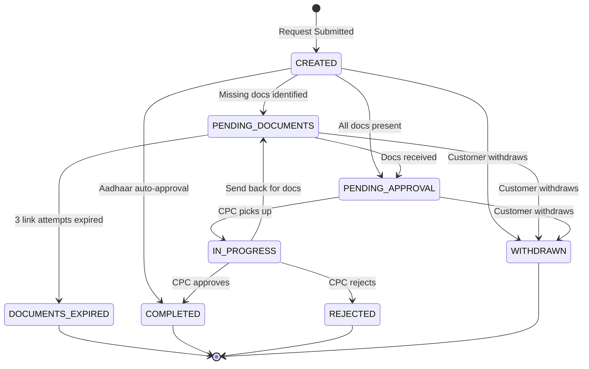
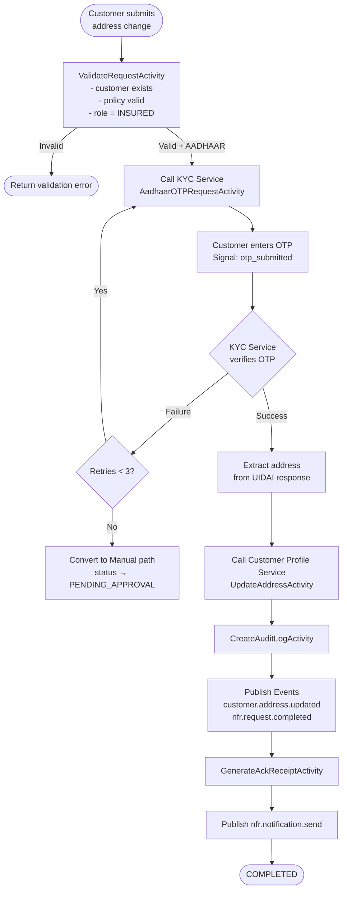
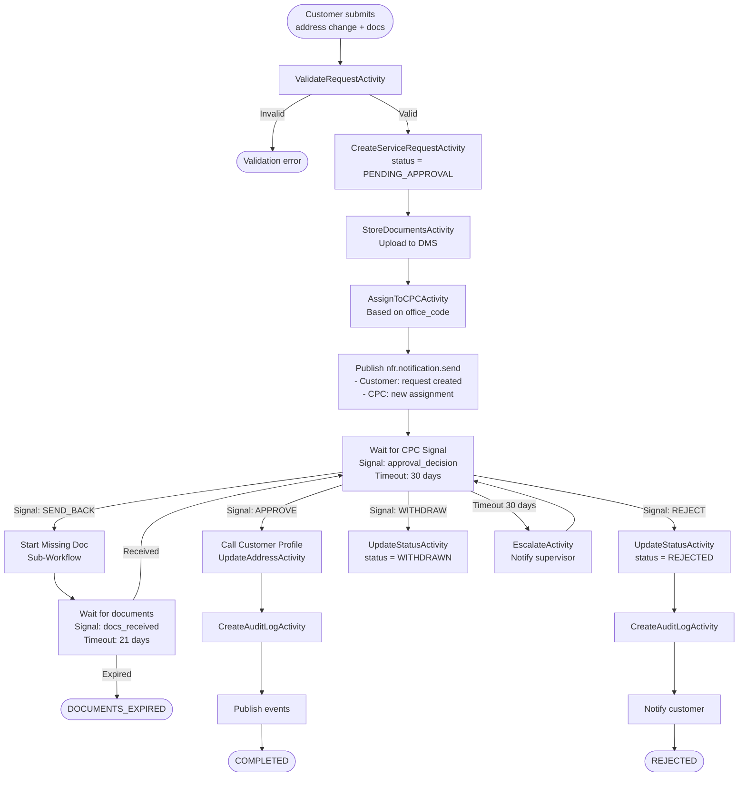
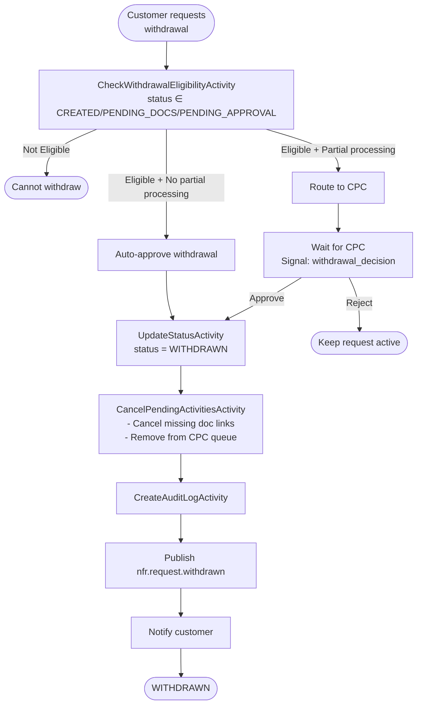

# Customer NFS (Non-Financial Service) Microservice — Requirements

**Service Name:** Customer NFS Service (customer-nfs-service)
**Version:** 1.0
**Date:** February 2026
**Status:** Draft
**Skills Used:** insurance-planner, insurance-analyst, insurance-architect

---

## 1. Executive Summary

The Customer NFS Service is a **dedicated microservice** responsible for orchestrating non-financial service requests that modify **customer master data**. It owns the workflow lifecycle (request creation, document collection, approval routing, execution) but delegates the actual data mutation to Customer Core Service via Temporal activities.

This service handles only customer-boundary changes. Policy-level NFS (nominee change, agent change, duplicate bond, refund of premium) belongs to their respective domain services.

### Scope Boundary

| In Scope (Customer NFS) | Out of Scope (Other Services) |
|---|---|
| Address Change (Aadhaar + Manual) | Agent Change → Policy Service |
| Name Change (Aadhaar + Manual) | Nominee Change → Policy Service |
| Withdrawal of customer NFS requests | Duplicate Policy Bond → Policy Service |
| Missing document collection for customer NFS | Refund of Premium → Billing Service |
| Service request lifecycle (create/track/approve) | Premium Receipt Book → Billing Service |
| Audit trail for all customer NFS operations | Communication dispatch → Notification Service |

### Why a Separate Microservice?

Customer Core Service is a **pure data service** — thin Temporal workflows wrapping CRUD activities, sub-millisecond response times, no business orchestration. NFS requests are the opposite: long-running workflows (15–30 day approval cycles), human-in-the-loop approvals, document collection with external links, multi-step maker-checker patterns, and Aadhaar OTP integration. Mixing these concerns into Customer Core would violate its design principle of being a fast, stateless data service.

The NFS Service **calls** Customer Core (via Temporal `ExecuteChildWorkflow`) to persist approved changes. It never writes directly to `customer_db`.

---

## 2. Architecture Context

### Service Position in Customer Domain

```
┌─────────────────────────────────────────────────────────────────┐
│  Customer NFS Service (this document)                           │
│  - Long-running approval workflows                              │
│  - Document collection & verification                           │
│  - Aadhaar OTP integration (via KYC Service)                    │
│  - Maker-checker approval routing                               │
│  - Owns: nfs_db (service requests, approvals, documents)        │
│  - Task Queue: customer-nfs-tq                                  │
├─────────────────────────────────────────────────────────────────┤
│                         ↓ calls                                 │
├──────────────────┬──────────────────┬───────────────────────────┤
│ Customer Core    │ Customer Profile │ KYC Service               │
│ (identity CRUD)  │ (address, contact│ (Aadhaar OTP,             │
│ customer-tq      │  employment)     │  identity verification)   │
│                  │ customer-prof-tq │ kyc-tq                    │
└──────────────────┴──────────────────┴───────────────────────────┘
```

### Key Architectural Decisions

| Decision | Rationale |
|---|---|
| Separate DB (`nfs_db`) from `customer_db` | NFS data (requests, approvals, documents) has different lifecycle, retention, and query patterns than customer master data |
| Temporal workflows for all NFS processing | Long-running (days/weeks), needs human-in-the-loop, compensation on failure, state persistence |
| Calls Customer Core/Profile for data mutation | Single writer principle — Customer Core owns customer writes. NFS orchestrates, Core persists |
| Aadhaar verification via KYC Service | Reuse existing UIDAI integration. NFS does not talk to UIDAI directly |
| Event-driven downstream notification | Publishes events; Notification Service, Policy Service, and others consume as needed |

---

## 3. Functional Requirements

### FR-NFS-001: Address Change via Aadhaar Authentication (Immediate)

- **Priority:** High
- **Description:** Customer initiates address change with Aadhaar OTP. On successful verification, the address fetched from UIDAI becomes the new address. No manual approval needed — change completes immediately.
- **Acceptance Criteria:**
  1. Customer provides customer_id, policy_number, Aadhaar number, and change type
  2. System sends OTP request to KYC Service → UIDAI
  3. Customer submits OTP; KYC Service verifies and returns Aadhaar address data
  4. If verified: NFS Service calls Customer Profile Service (`UpdateAddressActivity`) with new address from UIDAI
  5. Old address version marked `is_active=false`, new version created (address versioning per BR-CUST-009)
  6. Service request status set to COMPLETED immediately
  7. Events published: `customer.address.updated`, `nfr.request.completed`
  8. Acknowledgment receipt generated (PDF with ticket number)
  9. SMS/Email notification sent to customer
- **Source:** FS_ANC_001, FS_ANC_004, FS_ANC_006, FS_ANC_012, FS_ANC_013 [`Non-Financial_Service_SRS_NFR_Address_Change_Name_Change.md`]

### FR-NFS-002: Address Change via Manual Document Upload (Approval Workflow)

- **Priority:** High
- **Description:** When Aadhaar-based change is not possible (customer choice, Aadhaar unavailable, address mismatch), customer submits supporting documents. CPC user reviews and approves/rejects.
- **Acceptance Criteria:**
  1. Customer submits: customer_id, policy_number, new address fields, document uploads (Address Proof, Rental Agreement, Application Form)
  2. System creates service request with status PENDING_APPROVAL
  3. Service request assigned to CPC user at customer's servicing office
  4. CPC user can: Approve, Reject, Send Back for Corrections, or Request Missing Documents
  5. On Approve: NFS Service calls Customer Profile Service (`UpdateAddressActivity`); status → COMPLETED
  6. On Reject: reason recorded; customer notified; status → REJECTED
  7. On Request Missing Documents: triggers Missing Document sub-workflow (FR-NFS-009)
  8. Approval timeline: 15–30 business days
  9. SLA monitoring with escalation if approval exceeds timeline
- **Source:** FS_ANC_001, FS_ANC_002, FS_ANC_003, FS_ANC_005 [`Non-Financial_Service_SRS_NFR_Address_Change_Name_Change.md`]

### FR-NFS-003: Address Change for Multiple Roles

- **Priority:** Medium
- **Description:** Address change supports updating address for different roles on the policy: Insured, Proposer, Assignee, Trustee. Each role may have different addresses.
- **Acceptance Criteria:**
  1. `address_update_for` field supports: INSURED, PROPOSER, ASSIGNEE, TRUSTEE
  2. `address_type` field supports: COMMUNICATION, PERMANENT, OFFICIAL
  3. If role is INSURED, address propagates to customer master record
  4. If role is PROPOSER/ASSIGNEE/TRUSTEE, address stored as policy-level address (delegated to Policy Service)
  5. Only INSURED address changes are processed by this service; other roles forwarded to Policy Service
- **Source:** Section 4.4 Address Change Page fields [`Non-Financial_Service_SRS_NFR_Address_Change_Name_Change.md`]

### FR-NFS-004: Name Change via Aadhaar Authentication (Immediate)

- **Priority:** High
- **Description:** Customer initiates name change with Aadhaar OTP. On successful verification, the name from UIDAI becomes the authoritative name. No manual approval needed.
- **Acceptance Criteria:**
  1. Customer provides customer_id, policy_number, Aadhaar number
  2. OTP verification via KYC Service → UIDAI
  3. If verified: extract salutation, first_name, middle_name, last_name from UIDAI response
  4. NFS Service calls Customer Core Service (`UpdateIdentityActivity`) with new name fields
  5. Old name preserved in audit history (name_change_history table)
  6. **Name reflects across all linked policies** — event `customer.name.updated` published with `policies_affected` count
  7. Policy Service consumes event and updates policy records (policyholder name on bonds)
  8. Service request status set to COMPLETED immediately
  9. DOB remains immutable — name change does NOT alter DOB (BR-CUST-005)
- **Source:** FS_ANC_007, FS_ANC_008, FS_ANC_009 [`Non-Financial_Service_SRS_NFR_Address_Change_Name_Change.md`]

### FR-NFS-005: Name Change via Manual Document Upload (Approval Workflow)

- **Priority:** High
- **Description:** When Aadhaar-based name change is not possible, customer provides legal documents (Gazette Notification, Newspaper Notice, Application Form). CPC user verifies and approves.
- **Acceptance Criteria:**
  1. Customer submits: customer_id, policy_number, new name, salutation, document uploads
  2. Required documents (at least one): Gazette Notification, Newspaper Notification, Name Change Application Form
  3. System creates service request with status PENDING_APPROVAL
  4. CPC user verifies documents against submitted name
  5. Approval/Rejection/Send Back flows identical to FR-NFS-002
  6. On Approve: Customer Core updated, all linked policies updated, events published
  7. On Reject: reason logged, customer notified
  8. Approval timeline: 15–30 business days
- **Source:** FS_ANC_007, FS_ANC_003, FS_ANC_005 [`Non-Financial_Service_SRS_NFR_Address_Change_Name_Change.md`], Section 4.3 Name Change Page

### FR-NFS-006: Service Request Lifecycle Management

- **Priority:** High
- **Description:** Unified service request tracking for all customer NFS operations with status management, assignment, and SLA tracking.
- **Acceptance Criteria:**
  1. Every NFS operation creates a service request with unique ticket_number (format: `NFS-{TYPE}-{YYYYMMDD}-{SEQ}`)
  2. Status lifecycle: CREATED → PENDING_DOCUMENTS → PENDING_APPROVAL → IN_PROGRESS → COMPLETED / REJECTED / WITHDRAWN
  3. Each status transition logged with timestamp, user_id, reason
  4. Assignment to CPC user based on servicing office of the customer
  5. SLA tracking per NFS type: address change (15 days), name change (15 days), Aadhaar-based (immediate)
  6. Dashboard-queryable: pending requests by type, by office, by age, by status
  7. Acknowledgment receipt generated on request creation
- **Source:** FS_ANC_005, FS_ANC_010, FS_ANC_012 [`Non-Financial_Service_SRS_NFR_Address_Change_Name_Change.md`]

### FR-NFS-007: Withdrawal of Customer NFS Request

- **Priority:** Medium
- **Description:** Customer can withdraw a pending address/name change request before it is approved/completed. Withdrawal reverses any interim state.
- **Acceptance Criteria:**
  1. Withdrawal allowed only for requests in status: PENDING_DOCUMENTS, PENDING_APPROVAL
  2. Withdrawal NOT allowed for: COMPLETED, REJECTED, IN_PROGRESS (already being processed), WITHDRAWN
  3. Auto-approval for eligible withdrawals (status is PENDING_DOCUMENTS or PENDING_APPROVAL and no interim changes applied)
  4. Manual approval required if any partial processing has occurred
  5. On successful withdrawal: status → WITHDRAWN_BY_CUSTOMER, archived flag set
  6. Events published: `nfr.request.withdrawn`
  7. Customer notified via SMS/Email
  8. Audit trail records withdrawal with reason
- **Source:** FS_WSR_001–FS_WSR_006 [`Non-Financial_Service_SRS_Withdrawal_of_Request.md`]

### FR-NFS-008: Audit Trail for All NFS Operations

- **Priority:** Critical
- **Description:** Complete, tamper-proof audit trail for every NFS action: creation, document upload, status change, approval, rejection, withdrawal.
- **Acceptance Criteria:**
  1. Every action logged with: user_id, timestamp (UTC), action_type, old_value, new_value, IP address, channel
  2. Audit records are INSERT-only — no UPDATE or DELETE allowed
  3. Retention: 10 years minimum (per FS_AT_009)
  4. Audit data partitioned by year for query performance
  5. Exportable in PDF/Excel for regulatory reporting
  6. Changes reflected in reports and dashboards (per FS_ANC_010)
- **Source:** FS_ANC_011, FS_WSR_006 [`Non-Financial_Service_SRS_NFR_Address_Change_Name_Change.md`], FS_AT_001–FS_AT_009 [`BCP_KYC_IVRS_SRS_Management_of_Audit_of_all_transactions.md`]

### FR-NFS-009: Missing Document Collection Sub-Workflow

- **Priority:** Medium
- **Description:** When CPC user identifies missing documents during NFS review, system sends secure upload link to customer and tracks submission.
- **Acceptance Criteria:**
  1. CPC user selects missing document types from predefined list per NFS type
  2. System generates time-limited secure upload URL (configurable expiry, default 7 days)
  3. Notification sent to customer via SMS/Email/WhatsApp with upload link and instructions
  4. Customer uploads documents via link or submits physically at Post Office
  5. Physical submission: Post Office staff indexes document against Missing Document Request ID
  6. On document receipt: CPC user notified; request status moves from PENDING_DOCUMENTS → PENDING_APPROVAL
  7. If link expires without submission: reminder sent, new link generated (up to 3 attempts)
  8. After 3 expired links: request auto-closed with status DOCUMENTS_EXPIRED
  9. Previously raised missing document requests visible in a status table
- **Source:** FS_MRD_001–FS_MRD_005 [`Non-Financial_Service_SRS_Missing_Requirement_Document.md`], Section 4.3/4.4 Request Missing Document fields [`Non-Financial_Service_SRS_NFR_Address_Change_Name_Change.md`]

### FR-NFS-010: Multi-Channel Request Initiation

- **Priority:** High
- **Description:** NFS requests can be initiated from multiple channels with unified processing.
- **Acceptance Criteria:**
  1. Supported channels: Customer Portal, Mobile App, Post Office Counter (RICT), Call Center, Agent Portal
  2. Channel recorded on service request for SLA and reporting differentiation
  3. Post Office channel: requires Service Request Indexing page (staff-assisted)
  4. Portal/Mobile: self-service with Aadhaar option
  5. All channels converge to the same Temporal workflow — no channel-specific business logic
  6. Channel-specific validation: Aadhaar-based auto-approval only from Portal/Mobile (not Post Office counter)
- **Source:** FS_ANC_001, FS_WSR_001 [`Non-Financial_Service_SRS_NFR_Address_Change_Name_Change.md`], [`Non-Financial_Service_SRS_Withdrawal_of_Request.md`]

### FR-NFS-011: CPC User Work Queue and Dashboard

- **Priority:** Medium
- **Description:** CPC users need a work queue showing pending NFS requests assigned to their office, with ability to take action.
- **Acceptance Criteria:**
  1. Dashboard shows: pending requests grouped by type (Address Change, Name Change)
  2. Filters: by status, by SLA (within SLA, approaching SLA, breached SLA), by date range
  3. CPC user can open request details, view documents, and take action (Approve/Reject/Send Back)
  4. Assignment: auto-assigned to CPC pool at customer's servicing office; can be manually reassigned
  5. SLA breach alerts: notification to supervisor when request approaches/breaches SLA
  6. Request detail view shows: customer info (from Core), current data, proposed changes, uploaded documents, comments history, missing document status
- **Source:** FS_ANC_005, FS_MRD_004 [`Non-Financial_Service_SRS_NFR_Address_Change_Name_Change.md`], [`Non-Financial_Service_SRS_Missing_Requirement_Document.md`]

### FR-NFS-012: Notification on Status Updates

- **Priority:** High
- **Description:** Customer receives notifications at every status transition of their NFS request.
- **Acceptance Criteria:**
  1. Notification triggers: Request Created, Documents Received, Approval Pending, Approved, Rejected, Send Back, Withdrawn, Documents Expired
  2. Channels: SMS + Email (mandatory), WhatsApp (if opted-in per communication preferences)
  3. Notification content includes: ticket number, request type, new status, next action (if any)
  4. NFS Service publishes event; Notification Service handles dispatch (separation of concerns)
  5. Acknowledgment receipt attached to "Request Created" notification (PDF)
- **Source:** FS_ANC_013, FS_WSR_005 [`Non-Financial_Service_SRS_NFR_Address_Change_Name_Change.md`], [`Non-Financial_Service_SRS_Withdrawal_of_Request.md`]

---

## 4. Business Rules

### Address Change Rules

#### BR-NFS-001: Aadhaar-Based Address Change — Immediate Completion
- **Category:** Workflow
- **Priority:** High
- **Rule:** IF auth_method = AADHAAR AND aadhaar_otp_verified = TRUE THEN service_request.status = COMPLETED AND customer_address = aadhaar_response.address
- **Condition:** Aadhaar OTP successfully verified by KYC Service
- **Action:** Immediate address update without human approval
- **Source:** FS_ANC_004 [`Non-Financial_Service_SRS_NFR_Address_Change_Name_Change.md`]
- **Traceability:** FR-NFS-001

#### BR-NFS-002: Manual Address Change — Approval Required
- **Category:** Workflow
- **Priority:** High
- **Rule:** IF auth_method = MANUAL THEN service_request.status = PENDING_APPROVAL AND approval_timeline = 15–30 business days
- **Condition:** Document-based address change
- **Action:** Route to CPC user for document verification and approval
- **Source:** FS_ANC_005 [`Non-Financial_Service_SRS_NFR_Address_Change_Name_Change.md`]
- **Traceability:** FR-NFS-002

#### BR-NFS-003: Communication Address Update Propagation
- **Category:** Data Propagation
- **Priority:** High
- **Rule:** IF address_type = COMMUNICATION AND address_update_for = INSURED THEN update customer master communication address AND publish event for all downstream services
- **Condition:** Address change affects correspondence address
- **Action:** All future communications (policy documents, letters, receipts) use new address
- **Source:** FS_ANC_006 [`Non-Financial_Service_SRS_NFR_Address_Change_Name_Change.md`]
- **Traceability:** FR-NFS-001, FR-NFS-002

#### BR-NFS-004: Address Versioning — Never Overwrite
- **Category:** Data Integrity
- **Priority:** Critical
- **Rule:** Address updates NEVER overwrite existing records. Each update creates a new version with `is_active=true`. Previous version set to `is_active=false` with `effective_to=NOW()`.
- **Condition:** Any address change (Aadhaar or Manual)
- **Action:** Full address history preserved for audit and regulatory compliance
- **Retention:** 10 years minimum (FS_AT_009)
- **Source:** BR-CUST-009 [`req_customer_service_requirements_v2.md`], FS_AT_009 [`BCP_KYC_IVRS_SRS_Management_of_Audit_of_all_transactions.md`]
- **Traceability:** FR-NFS-001, FR-NFS-002, FR-NFS-008

#### BR-NFS-005: Address Role Boundary
- **Category:** Service Boundary
- **Priority:** High
- **Rule:** IF address_update_for ∈ {INSURED} THEN process in Customer NFS. IF address_update_for ∈ {PROPOSER, ASSIGNEE, TRUSTEE} THEN delegate to Policy Service.
- **Condition:** Address change for non-insured roles
- **Action:** Forward request to Policy Service with customer_id and policy_number
- **Source:** Section 4.4 Address Change Page, `Address Update For` dropdown [`Non-Financial_Service_SRS_NFR_Address_Change_Name_Change.md`]
- **Traceability:** FR-NFS-003

#### BR-NFS-006: Pincode-State Validation
- **Category:** Validation
- **Priority:** High
- **Rule:** IF pincode_prefix NOT IN valid_prefixes_for(state) THEN reject address change
- **Condition:** Address submission (all channels)
- **Action:** Reject with error "Pincode does not match selected state"
- **Source:** BR-CUST-002 [`req_customer_service_requirements_v2.md`]
- **Traceability:** FR-NFS-001, FR-NFS-002

### Name Change Rules

#### BR-NFS-007: Aadhaar-Based Name Change — Immediate Completion
- **Category:** Workflow
- **Priority:** High
- **Rule:** IF auth_method = AADHAAR AND aadhaar_otp_verified = TRUE THEN service_request.status = COMPLETED AND customer.name = aadhaar_response.name
- **Condition:** Aadhaar OTP successfully verified
- **Action:** Immediate name update without human approval
- **Source:** FS_ANC_008 [`Non-Financial_Service_SRS_NFR_Address_Change_Name_Change.md`]
- **Traceability:** FR-NFS-004

#### BR-NFS-008: Manual Name Change — Approval Required
- **Category:** Workflow
- **Priority:** High
- **Rule:** IF auth_method = MANUAL THEN service_request.status = PENDING_APPROVAL AND required_documents ∈ {Gazette Notification, Newspaper Notification, Name Change Application Form}
- **Condition:** Document-based name change
- **Action:** Route to CPC user; at least one legal document must be uploaded
- **Source:** FS_ANC_005, Section 4.3 Name Change Page [`Non-Financial_Service_SRS_NFR_Address_Change_Name_Change.md`]
- **Traceability:** FR-NFS-005

#### BR-NFS-009: Name Change Cross-Policy Propagation
- **Category:** Data Propagation
- **Priority:** Critical
- **Rule:** ON name change completion: publish `customer.name.updated` event with affected_policies list. Policy Service MUST update policyholder name on ALL linked policy records and bonds.
- **Condition:** Any completed name change (Aadhaar or Manual)
- **Action:** Name reflected across all linked policies, reports, and documents
- **Source:** FS_ANC_009 [`Non-Financial_Service_SRS_NFR_Address_Change_Name_Change.md`]
- **Traceability:** FR-NFS-004, FR-NFS-005

#### BR-NFS-010: DOB Immutability on Name Change
- **Category:** Data Integrity
- **Priority:** Critical
- **Rule:** Name change workflow MUST NOT modify date_of_birth. DOB is immutable after customer creation. Correction requires separate PLI Directorate approval process.
- **Source:** BR-CUST-005 [`req_customer_service_requirements_v2.md`]
- **Traceability:** FR-NFS-004, FR-NFS-005

### Service Request Rules

#### BR-NFS-011: Ticket Number Generation
- **Category:** Identification
- **Priority:** High
- **Rule:** Ticket number format: `NFS-{TYPE_CODE}-{YYYYMMDD}-{SEQ6}` where TYPE_CODE = ANC (Address/Name Change). Generated using PostgreSQL SEQUENCE.
- **Examples:** NFS-ANC-20260217-000001
- **Source:** Derived from service request indexing requirements [`Non-Financial_Service_SRS_NFR_Address_Change_Name_Change.md`]
- **Traceability:** FR-NFS-006

#### BR-NFS-012: Service Request Status Machine
- **Category:** State Transition
- **Priority:** High
- **State Machine:**



- **Source:** Consolidated from all NFS SRS files
- **Traceability:** FR-NFS-006, FR-NFS-007

#### BR-NFS-013: Withdrawal Eligibility
- **Category:** Workflow
- **Priority:** Medium
- **Rule:** Withdrawal allowed IF status ∈ {CREATED, PENDING_DOCUMENTS, PENDING_APPROVAL}. Withdrawal NOT allowed IF status ∈ {IN_PROGRESS, COMPLETED, REJECTED, WITHDRAWN, DOCUMENTS_EXPIRED}.
- **Source:** FS_WSR_002 [`Non-Financial_Service_SRS_Withdrawal_of_Request.md`]
- **Traceability:** FR-NFS-007

#### BR-NFS-014: Missing Document Link Expiry
- **Category:** Time-Based
- **Priority:** Medium
- **Rule:** Secure upload link expires after configurable period (default 7 days). Maximum 3 link generations per request. After 3 expired links: request auto-transitions to DOCUMENTS_EXPIRED.
- **Source:** FS_MRD_003 [`Non-Financial_Service_SRS_Missing_Requirement_Document.md`], Section 4.1 Secure Link Expiry Date
- **Traceability:** FR-NFS-009

#### BR-NFS-015: Aadhaar Auto-Approval Channel Restriction
- **Category:** Validation
- **Priority:** Medium
- **Rule:** Aadhaar-based auto-approval (immediate completion) is only available from digital channels: Portal, Mobile App. Post Office counter and Call Center channels always use manual approval workflow even if Aadhaar is provided.
- **Rationale:** Post Office staff-assisted flow needs maker-checker for accountability
- **Source:** Derived from channel-specific requirements analysis
- **Traceability:** FR-NFS-010

#### BR-NFS-016: Audit Trail Immutability
- **Category:** Compliance
- **Priority:** Critical
- **Rule:** All NFS audit records are INSERT-only. No UPDATE or DELETE permitted. Records include: action_type, user_id, timestamp_utc, old_value, new_value, ip_address, channel, office_code.
- **Retention:** 10 years minimum
- **Source:** FS_ANC_011 [`Non-Financial_Service_SRS_NFR_Address_Change_Name_Change.md`], FS_AT_002, FS_AT_009 [`BCP_KYC_IVRS_SRS_Management_of_Audit_of_all_transactions.md`]
- **Traceability:** FR-NFS-008

---

## 5. Data Requirements

### 5.1 Entity: NFS Service Request

**Description:** Central entity tracking every customer NFS request through its lifecycle.

| Attribute | Type | Mandatory | Description | Validation |
|---|---|---|---|---|
| request_id | UUID | Yes | Primary key | System-generated |
| ticket_number | VARCHAR(30) | Yes | Human-readable ID | Format: NFS-{TYPE}-{YYYYMMDD}-{SEQ6}, UNIQUE |
| customer_id | UUID | Yes | FK to customer | Must exist in Customer Core |
| request_type | VARCHAR(30) | Yes | NFS type | ENUM: ADDRESS_CHANGE, NAME_CHANGE |
| auth_method | VARCHAR(20) | Yes | Verification method | ENUM: AADHAAR, MANUAL |
| status | VARCHAR(30) | Yes | Current status | ENUM: CREATED, PENDING_DOCUMENTS, PENDING_APPROVAL, IN_PROGRESS, COMPLETED, REJECTED, WITHDRAWN, DOCUMENTS_EXPIRED |
| channel | VARCHAR(20) | Yes | Initiation channel | ENUM: Portal, Mobile, PostOffice, CallCenter, AgentPortal |
| office_code | VARCHAR(20) | No | Servicing office | For Post Office channel |
| initiated_by | UUID | Yes | User/customer who created | FK to users |
| assigned_to | UUID | No | CPC user assigned | FK to users (null for Aadhaar auto) |
| approved_by | UUID | No | CPC user who approved | FK to users |
| approval_date | TIMESTAMP | No | When approved/rejected | Set on terminal action |
| rejection_reason | TEXT | No | Why rejected | Required if status = REJECTED |
| sla_deadline | TIMESTAMP | No | SLA expiry | Calculated: created_at + SLA_days |
| policy_number | VARCHAR(20) | No | Associated policy | Context for address update |
| created_at | TIMESTAMP | Yes | Request creation time | System-generated (UTC) |
| updated_at | TIMESTAMP | Yes | Last update | System-generated (UTC) |
| completed_at | TIMESTAMP | No | Completion time | Set when status = COMPLETED |

### 5.2 Entity: NFS Address Change Detail

**Description:** Stores old and new address data for address change requests.

| Attribute | Type | Mandatory | Description | Validation |
|---|---|---|---|---|
| detail_id | UUID | Yes | Primary key | System-generated |
| request_id | UUID | Yes | FK to service request | Must exist |
| address_update_for | VARCHAR(20) | Yes | Role | ENUM: INSURED, PROPOSER, ASSIGNEE, TRUSTEE |
| address_type | VARCHAR(20) | Yes | Address category | ENUM: COMMUNICATION, PERMANENT, OFFICIAL |
| old_address_line1 | VARCHAR(200) | No | Previous address | Captured at request time |
| old_address_line2 | VARCHAR(200) | No | Previous address | |
| old_city | VARCHAR(100) | No | Previous city | |
| old_district | VARCHAR(100) | No | Previous district | |
| old_state | VARCHAR(50) | No | Previous state | |
| old_pincode | VARCHAR(10) | No | Previous pincode | |
| new_address_line1 | VARCHAR(200) | Yes | New address | Not empty |
| new_address_line2 | VARCHAR(200) | No | New address | |
| new_village | VARCHAR(100) | No | New village/town | |
| new_taluka | VARCHAR(100) | No | New taluka | |
| new_city | VARCHAR(100) | Yes | New city | Not empty |
| new_district | VARCHAR(100) | Yes | New district | Not empty |
| new_state | VARCHAR(50) | Yes | New state | Must be valid Indian state |
| new_pincode | VARCHAR(10) | Yes | New pincode | 6 digits, must match state (BR-NFS-006) |
| aadhaar_txn_id | VARCHAR(50) | No | UIDAI transaction ID | Present if auth_method=AADHAAR |

### 5.3 Entity: NFS Name Change Detail

**Description:** Stores old and new name data for name change requests.

| Attribute | Type | Mandatory | Description | Validation |
|---|---|---|---|---|
| detail_id | UUID | Yes | Primary key | System-generated |
| request_id | UUID | Yes | FK to service request | Must exist |
| old_salutation | VARCHAR(10) | No | Previous salutation | |
| old_first_name | VARCHAR(100) | No | Previous first name | |
| old_middle_name | VARCHAR(100) | No | Previous middle name | |
| old_last_name | VARCHAR(100) | No | Previous last name | |
| new_salutation | VARCHAR(10) | Yes | New salutation | ENUM: Mr, Mrs, Ms, Shri, Smt, Dr |
| new_first_name | VARCHAR(100) | Yes | New first name | Not empty, alpha + spaces only |
| new_middle_name | VARCHAR(100) | No | New middle name | Alpha + spaces only |
| new_last_name | VARCHAR(100) | Yes | New last name | Not empty, alpha + spaces only |
| policies_affected | INTEGER | No | Count of linked policies | Set on completion |
| aadhaar_txn_id | VARCHAR(50) | No | UIDAI transaction ID | Present if auth_method=AADHAAR |

### 5.4 Entity: NFS Document Upload

**Description:** Documents uploaded as part of NFS request processing.

| Attribute | Type | Mandatory | Description | Validation |
|---|---|---|---|---|
| document_id | UUID | Yes | Primary key | System-generated |
| request_id | UUID | Yes | FK to service request | Must exist |
| document_type | VARCHAR(50) | Yes | Document category | ENUM per request type (see below) |
| file_name | VARCHAR(200) | Yes | Original filename | |
| file_url | VARCHAR(500) | Yes | Storage URL | DMS reference |
| file_size_bytes | BIGINT | Yes | File size | Max 5 MB per file |
| mime_type | VARCHAR(50) | Yes | File type | ENUM: application/pdf, image/jpeg, image/png |
| uploaded_by | UUID | Yes | Who uploaded | Customer or Post Office staff |
| upload_channel | VARCHAR(20) | Yes | Upload source | Portal, Mobile, PostOffice, SecureLink |
| verification_status | VARCHAR(20) | No | CPC review status | ENUM: PENDING, VERIFIED, REJECTED |
| verified_by | UUID | No | CPC reviewer | |
| verified_at | TIMESTAMP | No | Verification time | |
| rejection_reason | TEXT | No | Why rejected | Required if verification_status=REJECTED |
| uploaded_at | TIMESTAMP | Yes | Upload time | System-generated |

**Document Types by Request:**

| Request Type | Required Documents | Optional Documents |
|---|---|---|
| Address Change (Manual) | Address Proof | Rental Agreement, Address Change Application Form |
| Name Change (Manual) | At least ONE of: Gazette Notification, Newspaper Notification | Name Change Application Form |

### 5.5 Entity: NFS Missing Document Request

**Description:** Tracks CPC-initiated requests for missing documents from customer.

| Attribute | Type | Mandatory | Description | Validation |
|---|---|---|---|---|
| missing_doc_id | UUID | Yes | Primary key | System-generated |
| request_id | UUID | Yes | FK to parent NFS request | Must exist |
| document_type | VARCHAR(50) | Yes | What's missing | From predefined list |
| secure_link_url | VARCHAR(500) | No | Customer upload URL | Time-limited |
| link_expiry | TIMESTAMP | No | When link expires | Default: created_at + 7 days |
| link_generation_count | INTEGER | Yes | Times link generated | Max 3 (BR-NFS-014) |
| status | VARCHAR(20) | Yes | Collection status | ENUM: PENDING, RECEIVED, EXPIRED, CANCELLED |
| received_at | TIMESTAMP | No | When document received | |
| received_via | VARCHAR(20) | No | Submission channel | ENUM: SecureLink, PostOffice, Portal |
| created_at | TIMESTAMP | Yes | Request time | System-generated |

### 5.6 Entity: NFS Audit Log

**Description:** Immutable audit trail for all NFS operations.

| Attribute | Type | Mandatory | Description | Validation |
|---|---|---|---|---|
| audit_id | UUID | Yes | Primary key | System-generated |
| request_id | UUID | Yes | FK to service request | |
| action_type | VARCHAR(50) | Yes | What happened | ENUM: CREATED, STATUS_CHANGE, DOCUMENT_UPLOAD, DOCUMENT_VERIFIED, ASSIGNED, APPROVED, REJECTED, WITHDRAWN, COMMENT_ADDED, MISSING_DOC_REQUESTED |
| old_value | JSONB | No | Previous state | JSON snapshot |
| new_value | JSONB | No | New state | JSON snapshot |
| performed_by | UUID | Yes | Who did it | User or system ID |
| performed_at | TIMESTAMP | Yes | When | UTC |
| ip_address | VARCHAR(50) | No | Source IP | |
| channel | VARCHAR(20) | No | Source channel | |
| office_code | VARCHAR(20) | No | Office context | |
| remarks | TEXT | No | Additional notes | |

**Partitioning:** BY RANGE (performed_at) — yearly partitions
**Retention:** 10 years minimum
**Constraints:** INSERT-only table — no UPDATE or DELETE permitted

---

## 6. Workflows

### Workflow 1: Address Change — Aadhaar Path



**Temporal Configuration:**
- Workflow ID: `nfs-address-aadhaar-{request_id}`
- Task Queue: `customer-nfs-tq`
- Execution Timeout: 10 minutes (OTP timeout)
- Signal: `otp_submitted` (customer enters OTP)

### Workflow 2: Address Change — Manual Approval Path



**Temporal Configuration:**
- Workflow ID: `nfs-address-manual-{request_id}`
- Task Queue: `customer-nfs-tq`
- Execution Timeout: 45 days (30 day approval + 15 day buffer)
- Signals: `approval_decision`, `docs_received`, `withdraw_request`
- Queries: `get_status`, `get_request_detail`

### Workflow 3: Name Change — Aadhaar Path

Identical structure to Workflow 1 but calls `UpdateIdentityActivity` on Customer Core Service instead of `UpdateAddressActivity` on Profile Service. Additionally publishes `customer.name.updated` with `policies_affected` count. Policy Service consumes event to update policy records.

**Temporal Configuration:**
- Workflow ID: `nfs-name-aadhaar-{request_id}`
- Task Queue: `customer-nfs-tq`
- Execution Timeout: 10 minutes

### Workflow 4: Name Change — Manual Approval Path

Identical structure to Workflow 2 but:
- Required documents: Gazette Notification / Newspaper Notification / Name Change Form
- On approval: calls `UpdateIdentityActivity` on Customer Core (name fields only, DOB immutable)
- Publishes `customer.name.updated` with `policies_affected` count
- Policy Service consumes event to update all linked policy records

**Temporal Configuration:**
- Workflow ID: `nfs-name-manual-{request_id}`
- Task Queue: `customer-nfs-tq`
- Execution Timeout: 45 days

### Workflow 5: NFS Request Withdrawal



**Temporal Configuration:**
- Workflow ID: `nfs-withdrawal-{request_id}`
- Task Queue: `customer-nfs-tq`
- Execution Timeout: 5 days (if manual CPC approval needed)

---

## 7. Activities Registry

| Activity | Service | Description | Timeout | Retry |
|---|---|---|---|---|
| ValidateRequestActivity | NFS (local) | Validate customer, policy, eligibility | 5s | 3x, 1s backoff |
| CreateServiceRequestActivity | NFS (local) | Insert service request + details into nfs_db | 5s | 3x, 1s backoff |
| StoreDocumentsActivity | NFS → DMS | Upload documents to Document Management Service | 30s | 3x, 5s backoff |
| AssignToCPCActivity | NFS (local) | Assign to CPC pool based on office_code | 5s | 3x, 1s backoff |
| AadhaarOTPRequestActivity | NFS → KYC Service | Trigger Aadhaar OTP via KYC Service | 10s | 2x, 5s backoff |
| AadhaarOTPVerifyActivity | NFS → KYC Service | Verify OTP and extract data | 10s | 2x, 5s backoff |
| UpdateAddressActivity | NFS → Customer Profile | Call Profile Service to update address | 5s | 3x, 2s backoff |
| UpdateIdentityActivity | NFS → Customer Core | Call Core Service to update name | 5s | 3x, 2s backoff |
| CreateAuditLogActivity | NFS (local) | Insert audit record | 5s | 5x, 1s backoff |
| GenerateAckReceiptActivity | NFS → Document Service | Generate PDF acknowledgment receipt | 15s | 3x, 5s backoff |
| CheckWithdrawalEligibilityActivity | NFS (local) | Check if request can be withdrawn | 3s | 3x, 1s backoff |
| CancelPendingActivitiesActivity | NFS (local) | Cancel pending missing doc links, remove from queue | 5s | 3x, 1s backoff |
| EscalateActivity | NFS (local) | Notify supervisor of SLA breach | 5s | 5x, 2s backoff |
| GenerateMissingDocLinkActivity | NFS (local) | Create time-limited secure upload URL | 5s | 3x, 1s backoff |

---

## 8. Events Published

| Event | Trigger | Payload | Consumers |
|---|---|---|---|
| `nfr.request.created` | Service request created | request_id, ticket_number, type, customer_id, channel | Notification Service |
| `nfr.request.completed` | Request reaches COMPLETED | request_id, ticket_number, type, customer_id | Notification, Audit |
| `nfr.request.rejected` | Request rejected by CPC | request_id, ticket_number, rejection_reason | Notification, Audit |
| `nfr.request.withdrawn` | Request withdrawn by customer | request_id, ticket_number, customer_id | Notification, Audit |
| `customer.address.updated` | Address change completed | customer_id, old_address, new_address, address_type, source_request_id | Policy Service, Claims, Billing, Notification |
| `customer.name.updated` | Name change completed | customer_id, old_name, new_name, policies_affected, source_request_id | Policy Service, Claims, Billing, Notification |
| `nfr.missing_doc.requested` | CPC requests missing docs | request_id, document_types[], customer_id | Notification (send upload link) |
| `nfr.sla.breached` | SLA deadline passed | request_id, ticket_number, assigned_to, sla_deadline | Notification (supervisor alert) |

## 9. Events Consumed

| Event | Source | Action |
|---|---|---|
| `approval.decision.made` | CPC UI / Workflow Signals | Unblock waiting workflow with approve/reject/send_back |
| `document.uploaded.external` | Secure Link / Post Office | Trigger docs_received signal on waiting workflow |

---

## 10. APIs Exposed

### POST /api/v1/nfs/address-change
Submit address change request (Aadhaar-based or manual).
- **Auth:** Required (Customer or Staff)
- **Request:** customer_id, policy_number, address fields, auth_method, aadhaar_otp (if Aadhaar), documents[] (if manual), channel
- **Response:** 201 → request_id, ticket_number, status (COMPLETED or PENDING_APPROVAL), approval_timeline

### POST /api/v1/nfs/name-change
Submit name change request (Aadhaar-based or manual).
- **Auth:** Required (Customer or Staff)
- **Request:** customer_id, policy_number, new name fields, auth_method, aadhaar_otp (if Aadhaar), documents[] (if manual), channel
- **Response:** 201 → request_id, ticket_number, status, policies_affected (if immediate)

### GET /api/v1/nfs/requests/{request_id}
Get NFS request details including status, documents, audit trail.
- **Auth:** Required (Customer who owns request, or CPC staff)
- **Response:** Full request detail with embedded documents and status history

### GET /api/v1/nfs/requests
List NFS requests with filters.
- **Auth:** Required
- **Query Params:** customer_id, status, request_type, office_code, assigned_to, sla_status (within/breached), page, page_size
- **Response:** Paginated list with total_count

### POST /api/v1/nfs/requests/{request_id}/withdraw
Withdraw a pending NFS request.
- **Auth:** Required (Customer who owns request)
- **Request:** reason
- **Response:** 200 → updated status, or 409 if not eligible

### POST /api/v1/nfs/requests/{request_id}/approve
CPC user approves request.
- **Auth:** Required (CPC staff role)
- **Request:** remarks
- **Response:** 200 → updated status

### POST /api/v1/nfs/requests/{request_id}/reject
CPC user rejects request.
- **Auth:** Required (CPC staff role)
- **Request:** rejection_reason (mandatory)
- **Response:** 200 → updated status

### POST /api/v1/nfs/requests/{request_id}/send-back
CPC user sends back for missing documents.
- **Auth:** Required (CPC staff role)
- **Request:** missing_document_types[]
- **Response:** 200 → missing_doc_request created, link generated

### POST /api/v1/nfs/requests/{request_id}/documents
Upload document for an NFS request.
- **Auth:** Required (Customer or Staff)
- **Request:** Multipart — document_type, file
- **Constraints:** Max 5 MB per file, PDF/JPEG/PNG only

### GET /api/v1/nfs/dashboard
CPC dashboard data — pending requests by type, SLA status, assignments.
- **Auth:** Required (CPC staff role)
- **Query Params:** office_code, request_type, sla_status
- **Response:** Aggregated counts and list

---

## 11. Error Codes

### Address/Name Change Errors (ERR-NFS-ANC-xxx)

| Code | HTTP | Description | Recovery |
|---|---|---|---|
| ERR-NFS-ANC-001 | 404 | Customer not found | Verify customer_id |
| ERR-NFS-ANC-002 | 404 | Policy not found or inactive | Verify policy_number |
| ERR-NFS-ANC-003 | 400 | Invalid address: pincode-state mismatch | Correct pincode or state |
| ERR-NFS-ANC-004 | 400 | Missing required documents for manual change | Upload required documents |
| ERR-NFS-ANC-005 | 400 | Invalid auth_method for channel | Aadhaar auto-approval not available from this channel |
| ERR-NFS-ANC-006 | 422 | Aadhaar OTP verification failed | Retry OTP or switch to manual |
| ERR-NFS-ANC-007 | 422 | Aadhaar OTP expired | Request new OTP |
| ERR-NFS-ANC-008 | 429 | OTP retry limit exceeded (3 attempts) | Wait and retry, or use manual path |
| ERR-NFS-ANC-009 | 400 | Name contains invalid characters | Use only alphabets and spaces |
| ERR-NFS-ANC-010 | 403 | DOB modification attempted via name change | DOB is immutable; separate process required |
| ERR-NFS-ANC-011 | 400 | Address role not in customer boundary | PROPOSER/ASSIGNEE/TRUSTEE → use Policy Service |
| ERR-NFS-ANC-012 | 503 | KYC Service unavailable | Retry or use manual path |
| ERR-NFS-ANC-013 | 500 | Customer Core/Profile update failed | Retry; workflow will compensate |

### Service Request Errors (ERR-NFS-SR-xxx)

| Code | HTTP | Description | Recovery |
|---|---|---|---|
| ERR-NFS-SR-001 | 409 | Duplicate request: pending request exists for same customer + type | Complete or withdraw existing request first |
| ERR-NFS-SR-002 | 409 | Cannot withdraw: request status not eligible | Request already processed |
| ERR-NFS-SR-003 | 404 | Service request not found | Verify request_id |
| ERR-NFS-SR-004 | 403 | Not authorized to act on this request | Only assigned CPC or owning customer |
| ERR-NFS-SR-005 | 422 | Missing rejection reason | Provide rejection_reason when rejecting |
| ERR-NFS-SR-006 | 410 | Secure upload link expired | Request new link (if attempts < 3) |
| ERR-NFS-SR-007 | 429 | Maximum missing doc link attempts reached (3) | Request auto-closed |
| ERR-NFS-SR-008 | 400 | File too large (max 5 MB) | Reduce file size |
| ERR-NFS-SR-009 | 400 | Unsupported file type | Use PDF, JPEG, or PNG |
| ERR-NFS-SR-010 | 503 | Document Management Service unavailable | Retry upload |

---

## 12. Validation Rules

| Rule ID | Entity | Field | Validation | Error Message |
|---|---|---|---|---|
| VR-NFS-001 | Address | pincode | 6 digits AND matches state | "Invalid pincode for selected state" |
| VR-NFS-002 | Address | state | Must be valid Indian state from master | "Invalid state" |
| VR-NFS-003 | Address | address_line1 | Not empty, max 200 chars | "Address line 1 is required" |
| VR-NFS-004 | Address | city | Not empty, max 100 chars | "City is required" |
| VR-NFS-005 | Address | district | Not empty, max 100 chars | "District is required" |
| VR-NFS-006 | Name | first_name | Not empty, alpha + spaces, max 100 | "First name is required" |
| VR-NFS-007 | Name | last_name | Not empty, alpha + spaces, max 100 | "Last name is required" |
| VR-NFS-008 | Name | salutation | Must be in {Mr, Mrs, Ms, Shri, Smt, Dr} | "Invalid salutation" |
| VR-NFS-009 | Document | file_size | Max 5 MB | "File exceeds maximum size of 5 MB" |
| VR-NFS-010 | Document | mime_type | Must be PDF, JPEG, or PNG | "Unsupported file format" |
| VR-NFS-011 | Request | auth_method | Must be AADHAAR or MANUAL | "Invalid authentication method" |
| VR-NFS-012 | Request | channel | Must be valid channel enum | "Invalid channel" |
| VR-NFS-013 | Address | address_update_for | If not INSURED, reject from NFS (→ Policy) | "Non-insured address changes handled by Policy Service" |
| VR-NFS-014 | Name | dob | Must NOT be present in name change request | "DOB cannot be modified via name change" |
| VR-NFS-015 | Request | duplicate_check | No PENDING request of same type for same customer | "A pending request already exists" |

---

## 13. Non-Functional Requirements

### NFR-NFS-001: Performance

| Metric | Target | Context |
|---|---|---|
| Aadhaar address/name change (happy path) | < 15 seconds p95 | OTP verification + data update |
| Service request creation (manual path) | < 500ms p95 | Request creation + document upload initiation |
| CPC approval action | < 200ms p95 | Signal delivery to workflow |
| Request status query | < 50ms p95 | Single row read by request_id |
| Dashboard query (pending requests) | < 500ms p95 | Indexed queries with aggregation |

### NFR-NFS-002: Concurrency

| Config | Value | Rationale |
|---|---|---|
| MaxConcurrentActivityExecutionSize | 50 | Moderate — mostly waiting on signals |
| MaxConcurrentWorkflowTaskExecutionSize | 100 | Many long-running workflows in parallel |
| WorkerActivitiesPerSecond | 200 | Rate limit to protect downstream services |
| PostgreSQL connection pool | 20 | NFS is not read-heavy like Core |

### NFR-NFS-003: Security

- All APIs authenticated via JWT
- CPC actions require CPC staff role (RBAC)
- Customer can only view/withdraw their own requests
- Aadhaar data never persisted in nfs_db (processed in-memory via KYC Service)
- Document uploads scanned for malware before storage
- Secure upload links: time-limited, single-use, cryptographically signed tokens

### NFR-NFS-004: Availability

- NFS workers: minimum 2 replicas
- REST API: minimum 2 replicas behind load balancer
- PostgreSQL: primary + standby with streaming replication
- RTO: < 10 minutes (NFS is not as latency-critical as Core)
- Long-running workflows survive service restarts (Temporal persistence)

### NFR-NFS-005: Data Retention

- Service requests: retained 10 years minimum (regulatory compliance)
- Audit logs: retained 10 years minimum, partitioned yearly
- Documents: retained in DMS per DMS retention policy (10 years)
- Completed/rejected requests: soft-archived after 1 year (queryable but moved to cold storage)

---

## 14. Technology Stack

| Component | Technology |
|---|---|
| Language | Go 1.21+ |
| Web Framework | Chi Router |
| Database | PostgreSQL 15 (nfs_db — separate from customer_db) |
| Workflow Orchestration | Temporal (task queue: customer-nfs-tq) |
| Document Storage | DMS (Document Management Service) |
| Caching | Redis (for dashboard aggregations, SLA countdown) |
| Observability | Prometheus + zap + OpenTelemetry |

---

## 15. Dependencies

### Upstream (services this depends on)

| Service | Purpose | Communication |
|---|---|---|
| Customer Core Service | Identity validation, name updates | Temporal child workflow on customer-tq |
| Customer Profile Service | Address updates, contact data fetch | Temporal child workflow on customer-prof-tq |
| KYC Service | Aadhaar OTP verification | Temporal child workflow on kyc-tq |
| Document Management Service | Document storage and retrieval | REST API |
| Notification Service | SMS/Email/WhatsApp dispatch | Event-driven (publishes events) |

### Downstream (services that depend on this)

| Service | Consumes | Purpose |
|---|---|---|
| Policy Service | `customer.address.updated`, `customer.name.updated` | Update policy records with new customer data |
| Claims Service | `customer.address.updated`, `customer.name.updated` | Update claim correspondence |
| Billing Service | `customer.address.updated` | Update billing correspondence |
| Notification Service | All `nfr.*` events | Send customer notifications |
| Audit Service | All `nfr.*` events | Centralized audit aggregation |

---

## 16. Traceability Matrix

| SRS Requirement | Functional Req | Business Rule | Validation | Workflow | API |
|---|---|---|---|---|---|
| FS_ANC_001 (online/PO address change) | FR-NFS-001, FR-NFS-002, FR-NFS-010 | BR-NFS-001, BR-NFS-002 | VR-NFS-001–005 | WF-1, WF-2 | POST /nfs/address-change |
| FS_ANC_002 (validate identity) | FR-NFS-001, FR-NFS-002 | — | VR-NFS-011 | WF-1, WF-2 | — |
| FS_ANC_003 (upload documents) | FR-NFS-002, FR-NFS-009 | BR-NFS-002 | VR-NFS-009, VR-NFS-010 | WF-2 | POST /nfs/.../documents |
| FS_ANC_004 (Aadhaar immediate) | FR-NFS-001 | BR-NFS-001 | — | WF-1 | POST /nfs/address-change |
| FS_ANC_005 (admin pending requests) | FR-NFS-011 | BR-NFS-002 | — | WF-2 | GET /nfs/dashboard |
| FS_ANC_006 (comm address update) | FR-NFS-001, FR-NFS-002 | BR-NFS-003 | — | WF-1, WF-2 | — |
| FS_ANC_007 (name change request) | FR-NFS-004, FR-NFS-005 | BR-NFS-007, BR-NFS-008 | VR-NFS-006–008 | WF-3, WF-4 | POST /nfs/name-change |
| FS_ANC_008 (Aadhaar name immediate) | FR-NFS-004 | BR-NFS-007 | — | WF-3 | POST /nfs/name-change |
| FS_ANC_009 (reflect across policies) | FR-NFS-004, FR-NFS-005 | BR-NFS-009 | — | WF-3, WF-4 | Event: customer.name.updated |
| FS_ANC_010 (reports/dashboards) | FR-NFS-006, FR-NFS-011 | — | — | — | GET /nfs/dashboard |
| FS_ANC_011 (audit trail) | FR-NFS-008 | BR-NFS-016 | — | All | Audit log entity |
| FS_ANC_012 (ack receipt) | FR-NFS-006, FR-NFS-012 | BR-NFS-011 | — | All | — |
| FS_ANC_013 (SMS/email notify) | FR-NFS-012 | — | — | All | Event: nfr.notification.send |
| FS_WSR_001 (initiate withdrawal) | FR-NFS-007 | BR-NFS-013 | — | WF-5 | POST /nfs/.../withdraw |
| FS_WSR_002 (validate eligibility) | FR-NFS-007 | BR-NFS-013 | VR-NFS-015 | WF-5 | — |
| FS_WSR_003 (auto-approve eligible) | FR-NFS-007 | BR-NFS-013 | — | WF-5 | — |
| FS_WSR_004 (update status) | FR-NFS-007 | BR-NFS-012 | — | WF-5 | — |
| FS_WSR_005 (notify customer) | FR-NFS-012 | — | — | WF-5 | Event: nfr.request.withdrawn |
| FS_WSR_006 (audit trail) | FR-NFS-008 | BR-NFS-016 | — | WF-5 | Audit log |
| FS_MRD_001 (CPC raise missing doc) | FR-NFS-009 | BR-NFS-014 | — | WF-2, WF-4 | POST /nfs/.../send-back |
| FS_MRD_002 (customer upload) | FR-NFS-009 | — | VR-NFS-009, VR-NFS-010 | WF-2, WF-4 | POST /nfs/.../documents |
| FS_MRD_003 (real-time alerts) | FR-NFS-012 | — | — | WF-2, WF-4 | Event: nfr.missing_doc.requested |
| FS_MRD_004 (dashboard monitoring) | FR-NFS-011 | — | — | — | GET /nfs/dashboard |
| FS_MRD_005 (auto-tag to SR) | FR-NFS-009 | — | — | WF-2, WF-4 | — |

---

## 17. Assumptions and Constraints

### Assumptions

| # | Assumption |
|---|---|
| A1 | Customer NFS Service is the ONLY writer to nfs_db. No other service has direct DB access. |
| A2 | Customer NFS Service does NOT write to customer_db. All customer data mutations go through Customer Core/Profile services via Temporal. |
| A3 | KYC Service handles all Aadhaar/UIDAI communication. NFS Service calls KYC, never UIDAI directly. |
| A4 | Policy Service is responsible for updating policy records when it consumes `customer.address.updated` / `customer.name.updated` events. NFS Service does not update policy records. |
| A5 | Only INSURED role address changes are processed by this service. PROPOSER/ASSIGNEE/TRUSTEE address changes are Policy Service responsibility. |
| A6 | Notification dispatch is handled by Notification Service consuming events. NFS Service does not send SMS/Email directly. |
| A7 | Document Management Service (DMS) handles storage, virus scanning, and retention of uploaded documents. |

### Constraints

| # | Constraint |
|---|---|
| C1 | Aadhaar auto-approval is limited to Portal and Mobile channels due to post-office accountability requirements. |
| C2 | Maximum 3 missing document link generations per request. |
| C3 | File uploads limited to 5 MB per file, PDF/JPEG/PNG only. |
| C4 | Audit logs cannot be modified or deleted — INSERT-only table. |
| C5 | DOB cannot be changed via name change workflow — requires separate PLI Directorate process. |

---

## 18. Open Questions

| # | Question | Impact | Proposed Answer |
|---|---|---|---|
| OQ-NFS-001 | Should name change for minor policyholder require guardian approval? | Workflow logic | Propose: Yes, add guardian consent step |
| OQ-NFS-002 | Can a customer have concurrent address AND name change requests? | Duplicate check logic | Propose: Yes, they are different types — allow concurrent |
| OQ-NFS-003 | Is there a fee for manual name/address change? | Business rules | Propose: No fee for address/name; fee only for Duplicate Policy Bond |
| OQ-NFS-004 | Should CPC approval be maker-checker (two-person) or single approver? | Workflow complexity | Propose: Single approver for NFS; maker-checker for financial operations only |
| OQ-NFS-005 | What is the exact SLA for address/name change at each office tier? | SLA configuration | Propose: 15 business days for Regional, 30 for Circle HQ. Needs stakeholder confirmation. |
